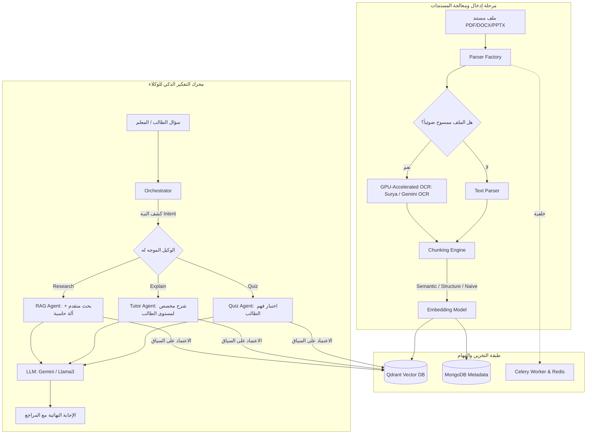

# Satr Edu AI - التشريح الشامل والدليل التفصيلي للمشروع (كل كبيرة وصغيرة)

مرحباً بك! هذا المستند يقدم لك تحليلاً تفصيلياً شاملاً وبنية برمجية دقيقة لكل جزء في مشروع **Satr Edu AI** (المحرك التعليمي المتقدم المعتمد على الـ RAG و نظام الوكلاء المتعددين Multi-Agent System). 

سنتناول في هذا الملف الهيكل العام، وكود كل موديول بالتفصيل، والعمليات الرياضية المخفية، وكيفية ترابط المكونات ببعضها.

---

## 1. نظرة عامة وتدفق النظام (System Architecture)

يعتمد **Satr Edu AI** على معالجة المستندات التعليمية غير المهيكلة (PDF, DOCX, PPTX, Images) وتحويلها إلى متجهات (Embeddings) لحفظها في قاعدة بيانات متجهة (**Qdrant**)، مع تخزين البيانات الوصفية والامتحانات وتاريخ الطلاب في **MongoDB**. 
يعمل النظام كمنسق ذكي للوكلاء (Orchestrator) يقوم بتوجيه الأسئلة للوكيل المناسب (تطوير، شرح، اختبار سريعة) ويتعلم ذاتياً لتعديل مستوى صعوبة الطالب رياضياً (Adaptive Learning).

---

## 2. موديول الوكلاء الذكي (src/agent/)

هذا القسم هو "دماغ" النظام الذي يتعامل مع مدخلات المستخدم ويحللها بشكل تفاعلي (Agentic Reasoning) بدلاً من البحث التقليدي (One-Shot RAG).

### 2.1. المنسق العام (src/agent/agents/orchestrator.py)
يعمل كبوابة استقبال لأسئلة الطلاب. بدلاً من إرسال كل شيء للـ RAG، يقوم بـ **Intent Detection** (تحديد نية المستخدم) وتوجيه السؤال للوكيل المناسب:
- **Tutor Agent**: يتم تفعيله إذا احتوى السؤال على كلمات مثل: `فهمني`، `اشرح`، `وضحلي`، `بسّط`، `يعني ايه`، `explain`، `what is`، `why`.
- **Quiz Agent**: يتم تفعيله إذا احتوى السؤال على كلمات مثل: `اختبرني`، `امتحني`، `اسألني`، `كويز`، `quiz me`، `test me`.
- **Research Agent (RAGAgent)**: الوكيل الافتراضي لأي سؤال معرفي عام أو مقارنة.
*تكه برمجية:* يحتوي على ناقل رسائل داخلي (`MessageBus`) يسجل كل خطوة تفكير للوكيل ليرسلها للـ Frontend كخطوات تفكير متتالية (Thinking Steps).

### 2.2. وكيل البحث المتقدم (src/agent/rag_agent.py)
يتميز عن الـ RAG العادي بأنه لا يبحث مرة واحدة ويجيب، بل يتبع الخطوات التالية:
1. **تفكيك السؤال (Query Decomposition):** لو كان السؤال مركباً (مثل: "قارن بين كذا وكذا" أو يحتوي على حرف العطف "و")، يقوم برمجياً بتقسيمه إلى أسئلة فرعية والبحث عن كل منها على حدة.
2. **البحث المكرر (Iterative Search):** يبحث في قاعدة البيانات المتجهة لكل سؤال فرعي ويجمع السياقات.
3. **أداة الحساب (Calculator Tool):** إذا اكتشف بوجود معادلة رياضية أو كلمة مثل `احسب` أو `calculate` أو رموز مثل `+,-,*,/` عبر الـ Regex، يقوم بتحويل السؤال لـ `CalculatorTool` لحساب النتيجة رياضياً بدلاً من تخمين الـ LLM.

### 2.3. وكيل الشرح المخصص (src/agent/agents/tutor_agent.py)
يستقبل `student_id` ليعرف مستوى إتقان الطالب في هذا الموضوع من محرك الصعوبة التكيفي، ويقوم بصياغة شرح مخصص يتناسب مع كونه مبتدئاً (يبسط المفاهيم) أو متقدماً (يدخل في تفاصيل أعمق).

### 2.4. وكيل الاختبارات السريعة (src/agent/agents/quiz_agent.py)
يقوم بإنشاء أسئلة تفاعلية سريعة للطالب بناءً على الجزء الذي قرأه للتو لتقييم مدى استيعابه الفوري.

### 2.5. أداة البحث عن المعرفة وتتبع المراجع (src/agent/tools/knowledge_search.py)
تقوم بالبحث المتجه في **Qdrant**.
*تكه برمجية:* لا تعيد فقط النصوص للـ LLM، بل تقوم بتركيب كائن متكامل اسمه **Citation** يحتوي على:
- `chunk_id`: المعرف الفريد للجزئية.
- `source_file`: اسم الملف الأصلي (مثال: `lecture1.pdf`).
- `page_number`: رقم الصفحة بدقة لتمكين الـ Frontend من عمل Highlight أصفر للسطر الذي تمت الإجابة منه.
- `relevance_score`: نسبة دقة وتطابق النتيجة مع سؤال الطالب.

---

## 3. محرك الصعوبة التكيفي (src/engine/adaptive_difficulty.py)

هذا هو قلب الذكاء الرياضي في التطبيق. يعمل بالكامل **بدون استخدام الذكاء الاصطناعي (Zero LLM Overhead)** لتوفير التكلفة والسرعة، معتمداً على نظرية استجابة البند المبسطة (**Item Response Theory - IRT**) والتكرار المتباعد (**Spaced Repetition**).

### 3.1. الحساب الرياضي لمستوى الإتقان (Mastery Score)
يتم تحديث مستوى إتقان الطالب (`TopicMastery`) في كل موضوع دراسي بناءً على معيار ELO (المستخدم في تصنيف لاعبي الشطرنج) من خلال الدالة `_update_mastery`:
- **إذا كانت الإجابة صحيحة:**
  $$MasteryScore_{new} = MasteryScore_{old} + LearningRate \times (1.0 - MasteryScore_{old})$$
- **إذا كانت الإجابة خاطئة:**
  $$MasteryScore_{new} = MasteryScore_{old} - LearningRate \times MasteryScore_{old}$$

*تكه برمجية:* يتم التحكم في معدل التعلم (`LearningRate`) ديناميكياً حسب صعوبة السؤال:
- الإجابة الصحيحة على سؤال **صعب** تمنح قفزة قوية في الإتقان (`LearningRate = 0.18`).
- الإجابة الخاطئة على سؤال **سهل** تسحب الطالب لأسفل بقوة لضمان ثبات أساسياته (`LearningRate = 0.08`).
- الأسئلة المتوسطة لها معدل ثابت (`0.12`).

### 3.2. الترقية وتخفيض الصعوبة (Difficulty Adjustment)
يتحكم الـ Engine بمستوى الصعوبة التالي للطالب برمجياً عبر العداد المتتالي (Streak Counter):
- **الترقية للمستوى الأعلى:** إذا جاوب الطالب **3 إجابات صحيحة متتالية** (`Streak >= 3`) في نفس الموضوع، يتم ترقية مستوى الصعوبة التلقائي (مثال: من Medium إلى Hard).
- **التخفيض للمستوى الأسهل:** إذا أخطأ الطالب في **إجابتين متتاليتين** (`Streak <= -2`)، يتم خفض الصعوبة تلقائياً (مثال: من Medium إلى Easy) لإعادة بناء ثقة الطالب وفهمه.

### 3.3. التكرار المتباعد (Spaced Repetition Intervals)
يقوم المحرك بجدولة المراجعات القادمة للموضوع بناءً على مستوى الإتقان كالتالي:
- **Mastered (إتقان >= 85%):** يجدول المراجعة بعد **14 يوماً**.
- **Learning (إتقان من 60% إلى 84%):** يجدول المراجعة بعد **3 أيام**.
- **Struggling (إتقان من 30% إلى 59%):** يجدول المراجعة بعد **24 ساعة**.
- **New (إتقان < 30%):** يجدول المراجعة بعد **ساعة واحدة** لإعادة المحاولة فوراً.

---

## 4. محرك التقييم وقياس جودة الـ RAG (src/evaluation/)

يحتوي المشروع على أداة قياس أكاديمية متكاملة (`src/evaluation/arabic_rag_benchmark.py`) لمقارنة استراتيجيات الـ RAG المختلفة على المحتوى العربي وتوليد تقارير JSON جاهزة للأوراق البحثية.

### 4.1. الاستراتيجيات المقارنة
1. **No RAG:** إرسال السؤال مباشرة للـ LLM للاعتماد على معرفته العامة (لقياس الهلوسة).
2. **Vector RAG:** استرجاع السياقات بالبحث المتجه العادي ثم الإجابة.
3. **Adaptive RAG:** تفعيل التصفية وإعادة الترتيب (Reranking) وتقسيم الأسئلة.

### 4.2. مقاييس الجودة الرياضية
لتجنب استدعاء الـ LLM المكلف لتقييم الإجابات، يعتمد المقيم على حسابات معجمية سريعة:
- **مقياس الأمانة (Faithfulness Score):** يقيس مدى تطابق كلمات الإجابة المولدة مع الإجابة المرجعية النموذجية (Ground Truth) باستخدام تشابه جاكارد (**Jaccard Similarity**):
  $$Faithfulness = \frac{|Words_{Generated} \cap Words_{Reference}|}{|Words_{Generated} \cup Words_{Reference}|}$$
  *تكه برمجية:* يتم استبعاد كلمات التوقف العربية (مثل: في، من، على، هو، هي) قبل الحساب لضمان دقة النتيجة وعدم تحيزها لحروف الجر.
- **مقياس الصلة بالسؤال (Relevancy Score):** يقيس نسبة الكلمات المفتاحية في سؤال الطالب التي ظهرت في الإجابة المولدة.
- **النتيجة الكلية (Composite Score):**
  $$Composite = 0.5 \times Faithfulness + 0.3 \times Relevancy + 0.2 \times (1 - ErrorRate)$$

---

## 5. خط معالجة وتقسيم البيانات (Ingestion & Chunking)

لكي يبحث النظام بدقة، يجب تقسيم الملفات الكبيرة إلى قطع صغيرة ذكية. يحتوي المشروع على المكونات التالية:

### 5.1. موديول القراءة (src/parsers/)
يستخدم نمط التصميم المصنع (`ParserFactory`) لتحديد القارئ المناسب للمستند:
- **PDF Parser:** يتعرف على نصوص PDF الأصلية، وإذا فشل أو وجد المستند ممسوحاً ضوئياً كصور، يقوم باستدعاء **Surya OCR** (خدمة OCR محلية سريعة جداً على كارت الشاشة GPU) أو **Gemini OCR** للحصول على النص بأعلى دقة ممكنة لدعم اللغة العربية.
- **DOCX, PPTX, XLSX, HTML, Text Parsers:** مستخرجات نصوص متخصصة لكل صيغة.

### 5.2. استراتيجيات التقسيم (src/chunking/)
يقدم المشروع 4 طرق لتقسيم النصوص:
1. **Naive Chunker:** تقسيم تقليدي معتمد على عدد الأحرف مع تداخل (Overlap) بسيط لمنع ضياع الكلمات بين القطع.
2. **Semantic Chunker:** يقيس التشابه الجيبي (Cosine Similarity) بين الجمل المتتالية، ويقوم بالتقسيم فقط عندما يقل التشابه عن حد معين (Threshold)، مما يعني الانتقال لموضوع أو فكرة جديدة تماماً.
3. **Structure Chunker:** يحافظ على التسلسل الهرمي للمستند، معتمداً على العناوين (`#`, `##`, H1, H2) والجداول لضمان بقاء العنوان مع محتواه في نفس الـ Chunk.
4. **QA Chunker:** يأخذ الـ Chunk ويستدعي الـ LLM لتوليد أسئلة متوقعة قد يسألها الطالب حول هذا النص، ثم يخزن هذه الأسئلة كمتجهات. عند البحث، يقارن النظام سؤال الطالب بالأسئلة المتوقعة مما يعطي دقة استرجاع أعلى بكثير من البحث في النص مباشرة.

---

## 6. قواعد البيانات والجداول (Database Schemas)

يعتمد التطبيق على هياكل بيانات Pydantic متكاملة لربط MongoDB بـ FastAPI:

### 6.1. جدول الامتحانات (Exam) - `src/models/scheme_db/exam.py`
يخزن تفاصيل الامتحان المولد بواسطة المعلم:
- `exam_id`: المعرف الفريد للامتحان.
- `status`: حالة الامتحان (`draft` مسودة لا يراها الطالب، أو `approved` معتمد ومتاح للحل).
- `question_ids`: قائمة الأسئلة التابعة للامتحان.
- `difficulty`: الصعوبة المستهدفة (`easy`, `medium`, `hard`, `mixed`).

### 6.2. جدول إجابات الطلاب (StudentAnswer) - `src/models/scheme_db/student_answer.py`
يخزن كل إجابة لسؤال مفرد قام الطالب بحله:
- `is_correct`: تصنيف فوري (MCQ / True-False).
- `score`: الدرجة المستحقة (خاصة في الأسئلة المقالية Essay حيث يتم التقييم بالذكاء الاصطناعي بناءً على إجابة نموذجية).
- `feedback`: تعليق مفصل للطالب يشرح نقاط الضعف والقوة في إجابته.

### 6.3. جدول نتائج الامتحانات (ExamResult) - `src/models/scheme_db/exam_result.py`
ملخص أداء الطالب في الامتحان الكلي:
- `total_score` / `max_score` / `percentage`.
- `weak_chunks`: **(تكه هامة جداً)** قائمة بالمعرفات المتجهة (`chunk_refs`) للقطع التي أخطأ الطالب في أسئلتها. يتم إرسالها لصفحة الكتاب في الواجهة الأمامية ليظهر للطالب تنبيه باللون الأحمر فوق الجزئية التي تحتاج لإعادة المراجعة في الكتاب المدرسي!

---

## 7. التحكم والتنسيق (Controllers & API Layer)

يربط هذا الجزء بين نماذج البيانات والـ Routes والـ AI:

### 7.1. متحكم الذكاء الاصطناعي (src/controllers/AIController.py)
هو المسؤول عن كتابة Prompts الموجهة للـ LLM وإدارة النتائج:
- **توليد الامتحانات (Exam Generation):** يرسل النص للـ LLM ويطلب توزيع الإجابات الصحيحة بشكل متساوٍ بين الاختيارات (A, B, C, D) لمنع انحياز الـ AI للحرف A (A-Bias).
- **إصلاح مخرجات الـ AI التالفة (JSON Repair):** إذا انقطعت إجابة الـ LLM أو حدث خطأ في تنسيق الـ JSON، تقوم الدالة `_repair_truncated_json` باستخدام تعبيرات منتظمة (Regex) للبحث عن الأسئلة المكتملة داخل النص واستخلاصها بدلاً من رفض الرد بالكامل وإظهار خطأ للمستخدم.
- **تقييم المقالات (Essay Grading):** يقارن إجابة الطالب بالإجابة النموذجية ويقيمها بناءً على معايير: دقة المفاهيم (40%)، الاكتمال (30%)، الوضوح (20%)، والتفاصيل الإضافية (10%)، ويرجع تقييم JSON كامل يحتوي على نقاط الضعف والملاحظات.

### 7.2. موديول المسارات (src/routes/)
يحتوي على أكثر من 80 endpoint موزعة بشكل منظم:
- `/api/v1/adaptive/explain/{exam_id}`: شرح نقاط الضعف والأخطاء للطالب بعد الامتحان.
- `/api/v1/adaptive/recommendations/{student_id}`: توصيات مخصصة للتحصيل الدراسي.
- `/api/v1/adaptive/study-plan/{student_id}`: إنشاء خطة دراسية مكثفة لمدة أسبوعين تركز على أضعف مواضيع الطالب.
- `/api/v1/agent/smart-ask`: استقبال السؤال وتوجيهه عبر الـ Orchestrator للوكيل المناسب مع إمكانية التحويل التلقائي للامتحان السريع (`auto_quiz`).
- `/api/v1/stream`: **(جديد)** استقبال إجابات الوكلاء الذكية عبر البث المباشر (SSE - Server-Sent Events) لتظهر الإجابة للطالب حرفاً بحرف بشكل تفاعلي سريع.

---

## 8. التهيئة وبداية التشغيل (main.py & Environments)

عند تشغيل التطبيق، تقوم دالة الـ `startup` بالخطوات التالية لضمان اتصال آمن وثابت:
1. **محاولة الاتصال بـ MongoDB:** تحتوي على حلقة تكرار (`Retry Loop`) تحاول الاتصال حتى 5 مرات مع تأخير 2 ثانية بين كل محاولة في حال كانت قاعدة البيانات تستغرق وقتاً للنهوض في بيئة Docker.
2. **اكتشاف خادم Ollama تلقائياً:** يقوم التطبيق بالبحث عن محرك تشغيل النماذج المحلية Ollama في عدة مسارات مرشحة:
   - المسار المعرف بالبيئة (`OLLAMA_BASE_URL`).
   - خادم الـ Localhost الافتراضي (`localhost:11434`).
   - مسار Docker الداخلي الموجه لنظام ويندوز المستضيف (`host.docker.internal:11434`).
   - محاولة التعرف على عنوان الـ Gateway الافتراضي الخاص بـ WSL2 لقراءة Ollama من نظام ويندوز المستضيف خارج بيئة لينكس.
3. **تأسيس كشاف النماذج:** استخدام Gemini 1.5 Flash لإنتاج النصوص العربية بأفضل صياغة وتنسيق.

---

لقد تم حفظ هذا التحليل المفصل في ملف مشروعك الخاص كمرجع هندسي متكامل لسهولة استخدامه في أي نقاش فني أو أثناء تطوير مميزات جديدة!
