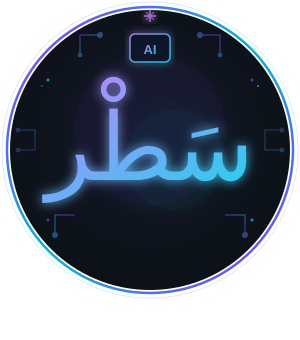

<div align="center">



<p><em>Transform your documents into intelligent, searchable knowledge using cutting-edge AI</em></p>

<p>
  <a href="https://github.com/ahmedmosalam2/Satr_Edu_Ai"></a>
  <a href="#-api-reference"></a>
  <a href="#-getting-started"></a>
  <a href="#-architecture"></a>
</p>

<p>
  <a href="https://fastapi.tiangolo.com/"></a>
  <a href="https://python.org/"></a>
  <a href="https://mongodb.com/"></a>
  <a href="https://pytorch.org/"></a>
  <a href="https://qdrant.tech/"></a>
  <a href="LICENSE"></a>
</p>

<p>
  <a href="#english">English</a> | <a href="#arabic">العربية</a>
</p>

---

</div>

## 📋 What is Satr Edu AI?

**Satr Edu AI** is an enterprise-grade platform that converts unstructured educational content into structured, AI-ready data. Whether you're building a RAG system, a document search engine, or an intelligent tutoring system — this platform handles the heavy lifting.

> **Built for educators and developers** who want to unlock the power of AI over their existing documents — without rebuilding everything from scratch.

<br/>

## 🎯 Features

<table>
<tr>
<td width="50%">

### 📄 Document Processing
- PDF, Word, PowerPoint, Excel
- HTML, Markdown, JSON, CSV
- Plain text files
- Automatic format detection

</td>
<td width="50%">

### 🤖 AI-Powered OCR
- Transformer-based vision models
- GPU acceleration support
- Handwritten text recognition
- Multi-language support

</td>
</tr>
<tr>
<td width="50%">

### ✂️ Smart Chunking
- Recursive text splitting
- Configurable chunk size & overlap
- Metadata preservation
- RAG-optimized output

</td>
<td width="50%">

### 🗄️ Vector Search
- Qdrant vector database
- Semantic similarity search
- BM25 keyword hybrid retrieval
- Cross-encoder re-ranking

</td>
</tr>
<tr>
<td width="50%">

### 🎓 Exam Generation
- AI-powered question creation
- Multiple choice & true/false
- Student performance analytics
- Celery async task queue

</td>
<td width="50%">

### 🔐 Auth & Management
- JWT authentication
- Role-based access control
- Project-based organization
- Admin dashboard routes

</td>
</tr>
</table>

<br/>

## 🚀 Getting Started

### Prerequisites

```
Python 3.10+
MongoDB 4.4+
Redis (for Celery async tasks)
CUDA GPU (optional, for OCR acceleration)
```

### Installation

```bash
# Clone the repository
git clone https://github.com/ahmedmosalam2/Satr_Edu_Ai.git
cd Satr_Edu_Ai

# Create virtual environment
python -m venv venv
source venv/bin/activate  # Windows: venv\Scripts\activate

# Install dependencies
pip install -r requirements.txt

# Setup environment
cp .env.example .env
```

### Configuration

```env
MONGODB_URL=mongodb://localhost:27017
MONGODB_DATABASE=satr_edu_ai
OCR_MODEL=microsoft/trocr-base-handwritten
APP_FILES_PATH=./src/assets/files
SECRET_KEY=your-secret-key-here
QDRANT_URL=http://localhost:6333
REDIS_URL=redis://localhost:6379
```

### Run

```bash
# Development
uvicorn main:app --reload --port 8000

# Production (with Docker)
docker-compose up -d
```

<br/>

## 📡 API Reference

### Authentication

```http
POST /api/v1/auth/register
POST /api/v1/auth/login
```

### Document Management

```http
POST   /api/v1/upload/{project_id}      # Upload document
POST   /api/v1/process/{project_id}     # Process & chunk
GET    /api/v1/assets/{project_id}      # List documents
DELETE /api/v1/assets/{asset_id}        # Delete document
```

### AI & Search

```http
POST /api/v1/ai/search                  # Semantic search
POST /api/v1/ai/exam/generate           # Generate exam
POST /api/v1/ai/exam/submit             # Submit answers
GET  /api/v1/analytics/performance      # Student analytics
```

<br/>

## 🏗️ Architecture

```
┌─────────────────────────────────────────────────────────┐
│                    FastAPI Server                        │
├─────────────────────────────────────────────────────────┤
│   Routes          Controllers         Helpers           │
│   ├─ auth         ├─ Data            ├─ Config         │
│   ├─ data         ├─ Process         ├─ OCR            │
│   ├─ ai           ├─ AI              ├─ Reranker       │
│   └─ analytics    ├─ Analytics       └─ Embeddings     │
│                   └─ Project                            │
├─────────────────────────────────────────────────────────┤
│   Models                                                │
│   ├─ ProjectModel  ├─ AssetModel   ├─ ChunkModel      │
│   ├─ ExamResult    ├─ UserModel    └─ enums/           │
│   └─ scheme_db/                                         │
├─────────────────────────────────────────────────────────┤
│   Infrastructure                                        │
│   ├─ MongoDB (Motor)    ├─ Qdrant (Vector DB)          │
│   └─ Redis + Celery (Async Tasks)                      │
└─────────────────────────────────────────────────────────┘
```

<br/>

## 📁 Project Structure

```
Satr_Edu_Ai/
├── main.py                 # Entry point
├── requirements.txt        # Dependencies
├── Dockerfile              # Docker config
├── docker/                 # Docker compose files
└── src/
    ├── controllers/        # Business logic
    │   ├── AIController.py
    │   ├── OCRController.py
    │   ├── AnalyticsController.py
    │   └── ...
    ├── routes/             # API endpoints
    │   ├── data.py
    │   ├── ai.py
    │   └── schemes/        # Pydantic schemas
    ├── models/             # Data models
    │   ├── scheme_db/      # MongoDB documents
    │   └── enums/          # Enum types
    ├── helpers/            # Utilities
    │   ├── reranker.py
    │   └── ...
    └── assets/             # File storage
```

<br/>

## 🛠️ Tech Stack

| Category | Technologies |
|----------|-------------|
| **Backend** | FastAPI, Uvicorn, Pydantic |
| **AI / ML** | PyTorch, Transformers, LangChain, TrOCR |
| **Search** | Qdrant, BM25, Cross-Encoder Re-ranking |
| **Database** | MongoDB, Motor (async) |
| **Task Queue** | Celery, Redis |
| **Documents** | PyPDF2, python-docx, Unstructured |
| **DevOps** | Docker, Docker Compose |

<br/>

## 📜 License

MIT License © 2024 — Satr Edu AI

---

<div align="center">

**Built with ❤️ for the future of education**

<br/>

<a href="https://github.com/ahmedmosalam2/Satr_Edu_Ai/stargazers"></a>
&nbsp;
<a href="https://github.com/ahmedmosalam2/Satr_Edu_Ai/network/members"></a>

</div>
