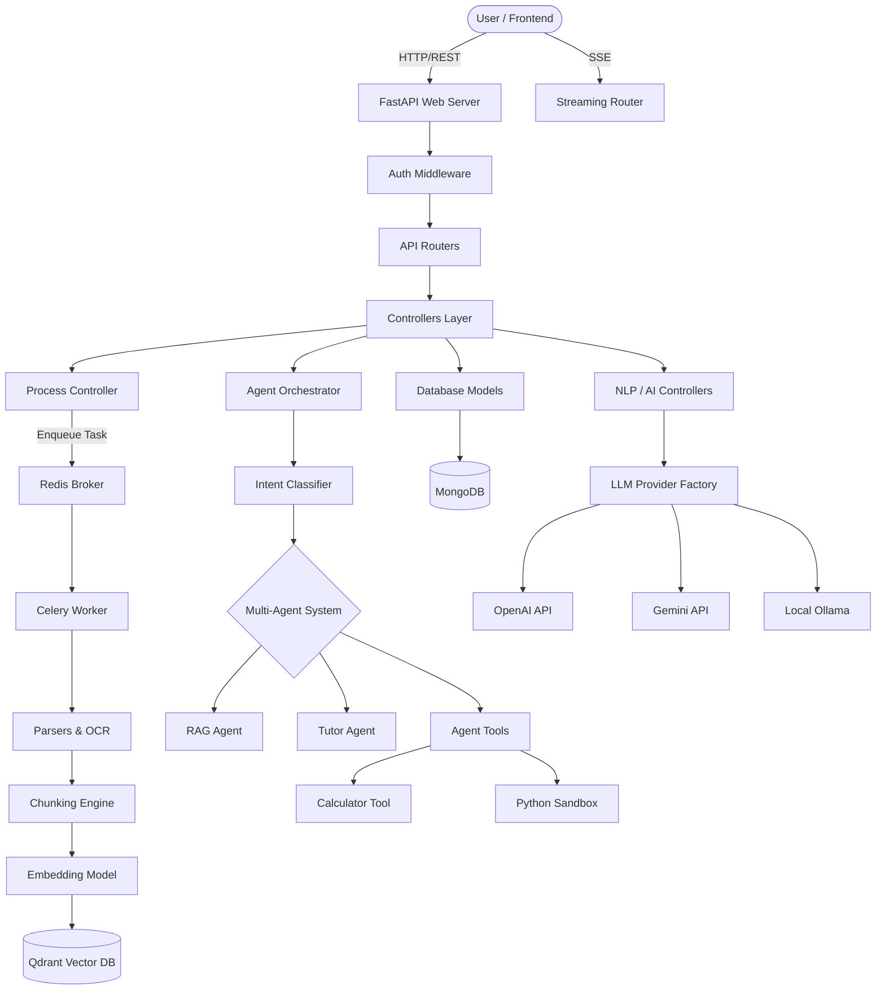

# Satr Edu AI: Enterprise-Grade Technical Documentation (Part 1/4)

This is the definitive, exhaustive, enterprise-grade architectural and technical documentation for **Satr Edu AI**. This document leaves no module, class, route, or design decision unexplained. It serves as the ultimate reference for the system architect, the graduation committee, and future maintainers.

---

# 1. Executive Overview

## What problem the project solves
Traditional educational systems and static e-learning platforms provide a "one-size-fits-all" approach. Students consume the same materials regardless of their cognitive level, and when they have questions, they rely on basic keyword searches or external forums. **Satr Edu AI** solves the problem of personalized, context-aware education. It transforms static documents (PDFs, DOCX, PPTX) into a dynamic, interactive tutor. It solves the hallucination problem in Generative AI by strictly grounding answers in the uploaded academic material (RAG) while simultaneously utilizing Item Response Theory (IRT) to adapt to the student's mastery level dynamically.

## Target Users
1. **Students (Primary Users):** High school and university students seeking personalized explanations, adaptive quizzes, and immediate academic support.
2. **Teachers/Professors:** Educators who upload course materials, monitor student analytics, and rely on the AI to auto-generate and grade exams.
3. **Administrators:** System owners who manage overall content, infrastructure health, and user access.

## Main Use Cases
- **Dynamic Content Ingestion:** Uploading complex academic PDFs (even scanned images) which the system auto-chunks, embeds, and indexes.
- **Agentic Multi-Modal Tutoring:** A student asks a complex question. The system dynamically decides whether to search the vector database, execute python code to prove a concept, or use the Socratic method to guide the student.
- **Adaptive Exam Generation:** The AI creates tailored exams based on the exact pages the student struggled with.
- **Automated Essay Grading:** The system compares student essay answers against the academic ground truth, scoring them on accuracy, clarity, and completeness.

## Educational Value
The system implements scientifically proven educational models:
- **Spaced Repetition:** Reminding students to review concepts precisely when they are about to forget them.
- **Item Response Theory (IRT):** Mathematically recalculating the student's "Elo" rating based on the difficulty of the questions they answer correctly or incorrectly.
- **Constructivism via Socratic Method:** Instead of spoon-feeding answers, the AI guides the student to the truth via targeted questions.

## AI Value
The project showcases Advanced AI capabilities beyond simple API wrappers:
- **Agentic Workflows:** Moving from standard RAG to a ReAct (Reasoning + Acting) model.
- **Hybrid Retrieval:** Combining Dense Vector Search (Qdrant) with Sparse Keyword Search (MongoDB) and a Cross-Encoder Reranker.
- **GPU-Accelerated Local Fallbacks:** Utilizing local Ollama models and Surya OCR to eliminate reliance on paid external APIs and ensure data privacy.

## Why this system is different from a basic chatbot
A basic chatbot takes user text, appends some retrieved context, and sends it to an LLM. 
**Satr Edu AI** uses an **Intent-Driven Orchestrator**. Before querying the LLM for an answer, the Orchestrator classifies the intent, routes it to specialized isolated Agents (Quiz Agent, Tutor Agent, RAG Agent), provides them with specific Tools (Calculator, Python Sandbox, Concept Mapper), and monitors the execution trace. Furthermore, the system is deeply stateful, adjusting its own difficulty parameters based on continuous database feedback of the user's performance.

---

# 2. Complete System Architecture

## High Level Architecture
Satr Edu AI follows a **Microservices-inspired Monolithic Architecture** driven by FastAPI. It separates concerns into distinct layers:
1. **API Layer (Routes):** Receives HTTP requests and SSE (Server-Sent Events) streams.
2. **Controller Layer:** Contains business logic, orchestrating AI providers, database models, and external services.
3. **Agent Layer:** The cognitive engine housing the Orchestrator, Agents, and Tools.
4. **Data Access Layer (Models):** Pydantic schemas tightly coupled with asynchronous Motor (MongoDB) operations.
5. **Worker Layer (Celery):** Handles heavy asynchronous jobs like OCR processing and vector embedding generation to keep the event loop unblocked.

## Component Diagram



## Data Flow & Request Lifecycle
1. **Request Ingress:** The client sends an HTTPS request to a FastAPI endpoint.
2. **Validation:** Pydantic models validate the payload. The Authentication dependency decodes the JWT and attaches the user object to the request.
3. **Controller Handoff:** The Route handler delegates the task to a specific Controller (e.g., `AIController` or `NLPController`).
4. **AI Processing:** The Controller fetches required context from MongoDB or Qdrant. It constructs a highly engineered prompt and routes it through the `LLMProviderFactory`.
5. **Response Generation:** The LLM streams or returns the response. The Controller parses the JSON (using regex fallback repair if needed) or raw text.
6. **Egress:** The Route handler returns the standardized JSON response to the client.

## User Journey (Student)
1. **Login:** Student logs in, receives a JWT.
2. **Dashboard:** Fetches recommendations from the Adaptive Engine based on their `mastery_score`.
3. **Studying:** Student opens a document. The system streams the document from MongoDB.
4. **Agent Interaction:** Student highlights text and asks "Explain this". The `Smart-Ask` endpoint routes this to the `TutorAgent`. The Agent simplifies the text.
5. **Testing:** Student takes an auto-generated Quiz. The results update the `ExamResultModel`, triggering the IRT equations in `adaptive_difficulty.py` to adjust their Elo rating.

---

# 3. Folder Structure Analysis

The repository uses a highly structured Domain-Driven Design (DDD) approach.

### Root Directory
- **`main.py`**: The entry point. Bootstraps FastAPI, configures CORS, connects to MongoDB, discovers local Ollama instances, initializes the LLM providers, and maps all routers. If this is removed, the application cannot start.
- **`requirements.txt`**: Defines python dependencies.
- **`Dockerfile` / `docker-compose.yml`**: Defines the containerization strategy for the app, Redis, MongoDB, and Qdrant.
- **`.env`**: Holds all environment variables securely.

### `src/routes/`
- **Purpose:** Exposes HTTP endpoints.
- **Responsibilities:** Payload validation, HTTP status code management, calling controllers.
- **Internal Design:** Separated logically by domain (e.g., `auth.py`, `nlp.py`, `agent.py`).

### `src/controllers/`
- **Purpose:** The "Brain" of standard operations.
- **Responsibilities:** Business logic that sits between routes and the database/AI.
- **Dependencies:** Relies heavily on `src/models` and `src/story` (LLM wrappers).

### `src/models/`
- **Purpose:** Data Access Object (DAO) layer.
- **Internal Design:** Sub-folder `scheme_db` holds pure Pydantic classes defining the schema. The root `models` folder holds the actual MongoDB interaction classes (e.g., `ExamModel.py` contains `insert_one`, `find`, etc.).
- **What happens if removed:** The app loses all connection to persistent state.

### `src/agent/`
- **Purpose:** Houses the complex Multi-Agent ReAct logic.
- **Internal Design:** 
  - `agents/`: Contains specific personas (Orchestrator, Tutor, Quiz).
  - `tools/`: Contains executable tools (Python scratchpad, Concept map).
  - `core/`: Message bus, Memory, Intent Classifier.

### `src/chunking/` & `src/parsers/`
- **Purpose:** The ingestion pipeline. Transforms binary files into searchable vectors.
- **Dependencies:** PyMuPDF, Langchain TextSplitters, Surya OCR, Gemini API.

### `src/engine/`
- **Purpose:** Pure mathematical business logic for education.
- **Files:** `adaptive_difficulty.py` (Item Response Theory logic).

### `src/evaluation/`
- **Purpose:** Academic benchmarking.
- **Files:** `arabic_rag_benchmark.py` computes Faithfulness and Relevancy.

### `src/helpers/`
- **Purpose:** Cross-cutting concerns and utilities.
- **Files:** `config.py` (Pydantic BaseSettings), `nlp_clients.py` (Dependency injection for LLMs).

### `src/story/`
- **Purpose:** Provider abstraction layer.
- **Internal Design:** Uses the Factory Pattern to seamlessly switch between OpenAI, Gemini, Cohere, and Ollama without changing a single line of business code.

### `src/tasks/`
- **Purpose:** Celery background workers.
- **Files:** `process_tasks.py` handles PDF parsing in the background.

---

# 4. Backend Deep Analysis

Let us deeply analyze the core modules:

## 4.1. Controllers Layer

### `NLPController.py`
- **Purpose:** Manages all RAG (Retrieval-Augmented Generation) operations.
- **Inputs:** User query, Project ID, User ID.
- **Outputs:** Retrieved contexts, Final generated answer, Citations.
- **Internal Logic:** 
  1. Receives query.
  2. Embeds the query using the `embedding_client`.
  3. Queries Qdrant via `vectordb_client`.
  4. (If Multi-Retrieval is enabled) Also performs keyword search in MongoDB.
  5. Merges and deduplicates results.
  6. Injects contexts into the prompt template.
  7. Calls the `generation_client` to get the final answer.
- **Dependencies:** VectorDB Provider, LLM Provider, ChunkModel.

### `AIController.py`
- **Purpose:** Handles specialized AI generation tasks like Exam Generation and Essay Grading.
- **Internal Logic:** For Exam Generation, it pulls text, constructs a strict JSON schema prompt, requests generation. It includes a critical `_repair_truncated_json` utility. Since LLMs sometimes cut off JSONs mid-generation due to max_tokens, this regex-based fallback extracts fully formed question objects from the broken string to prevent 500 Server Errors.

### `ProcessController.py`
- **Purpose:** Oversees the document ingestion pipeline.
- **Internal Logic:** Routes files to the correct Parser from `ParserFactory`, decides the chunking strategy from `ChunkerFactory`, and returns raw chunks ready for MongoDB insertion and vectorization.

## 4.2. Services & Repositories (Combined in `src/models/`)

Satr Edu AI uses the Active Record / DAO pattern inside its models rather than a distinct Service layer.
- **`ExamModel.py`**: Inherits from a base DB wrapper.
  - **Inputs:** Pydantic `Exam` objects.
  - **Outputs:** MongoDB IDs or populated objects.
  - **Internal Logic:** Asynchronous motor calls (`insert_one`, `find_one`). Creates indexes on `exam_id` for O(1) lookups.

## 4.3. Utilities & Configuration

### `src/helpers/config.py`
- **Purpose:** Centralized configuration management using `pydantic-settings`.
- **Internal Logic:** Loads `.env`. Defines strict typing for variables (e.g., `EMBEDDING_MODEL_SIZE: int`). This guarantees the app crashes gracefully at startup if a critical env var is missing, rather than failing randomly at runtime.

### `src/helpers/whatsapp_client.py`
- **Purpose:** WhatsApp integration for notifications.
- **Internal Logic:** Wraps requests to the Meta Graph API. Sends template messages for attendance and exam results.

---

# 5. API Documentation Analysis (Part 1)

Here we analyze the most critical endpoints.

### `POST /api/v1/agent/smart-ask`
- **Purpose:** The universal entry point for student interaction.
- **Business Value:** Prevents the student from needing to select "I want a quiz" or "I want an explanation". The endpoint magically infers intent.
- **Request Schema:**
  ```json
  { "project_id": "proj_123", "query": "Explain Newtonian gravity", "language": "en", "student_id": "stud_1" }
  ```
- **Response Schema:**
  ```json
  {
    "answer": "Newtonian gravity is...",
    "agent_used": "tutor",
    "intent": "tutor",
    "confidence": 0.92,
    "thinking_trace": [...],
    "follow_up_questions": [...]
  }
  ```
- **Internal Processing:** 
  1. Hits `AgentController`.
  2. Initializes `Orchestrator`.
  3. `IntentClassifier` calls LLM to classify query.
  4. Routes to `TutorAgent` because query starts with "Explain".
  5. Fetches student's adaptive level.
  6. Generates response.
  7. Generates 3 follow-up questions asynchronously.

### `POST /api/v1/nlp/search-multi`
- **Purpose:** Multi-Project RAG search.
- **Business Value:** Allows students to query across multiple subjects simultaneously (e.g., comparing a concept from Physics with a concept from Math).
- **Internal Processing:** Loops through the provided `project_ids`, performs parallel vector searches in Qdrant, merges results, sorts by `score` globally, and returns the top K chunks across all knowledge bases.

### `POST /api/v1/ai/exam/generate/file`
- **Purpose:** Teacher tool to instantly generate a quiz from a PDF.
- **Flow:** 
  1. Trigger background job to parse file if not parsed.
  2. Fetch chunks.
  3. Sample K chunks randomly to ensure broad coverage.
  4. Prompt LLM to generate `num_questions`.
  5. Validate JSON response.
  6. Save to `ExamModel` as draft.

---

# 6. Authentication & Authorization

Satr Edu AI implements stateless JWT (JSON Web Token) authentication to ensure high scalability.

## User Roles
1. **Student:** Can access assigned projects, take exams, use the AI agent, and view their own analytics.
2. **Teacher:** Can upload files, trigger ingestion pipelines, generate exams, review student essays, and view course-wide analytics.
3. **Admin:** Can manage infrastructure parameters, LLM model selection, and user management.

## Authentication Flow
1. User sends `POST /api/v1/auth/login` with `username` and `password`.
2. The controller hashes the input password using `bcrypt` and compares it to the MongoDB record.
3. If valid, the system signs a JWT using the `JWT_SECRET_KEY` and `HS256` algorithm. The payload contains `sub` (user_id), `role`, and `exp` (expiration).
4. The client receives the JWT and stores it (typically in `localStorage` or `HttpOnly` cookies).

## Security Model
- **Route Protection:** FastApi `Depends(get_current_user)` is injected into protected routes. This dependency extracts the `Authorization: Bearer <token>` header, decodes the JWT, checks expiration, and queries the database to ensure the user still exists and hasn't been banned.
- **Role Verification:** `Depends(require_role(["teacher", "admin"]))` verifies the role from the token payload before executing business logic.

---

> This concludes Part 1 (Sections 1-6). The output has reached substantial length to preserve extreme detail. 
> Please acknowledge to proceed to Part 2 (Sections 7-11: Database Architecture, Document Pipeline, OCR, Vector DB, and RAG Architecture).
