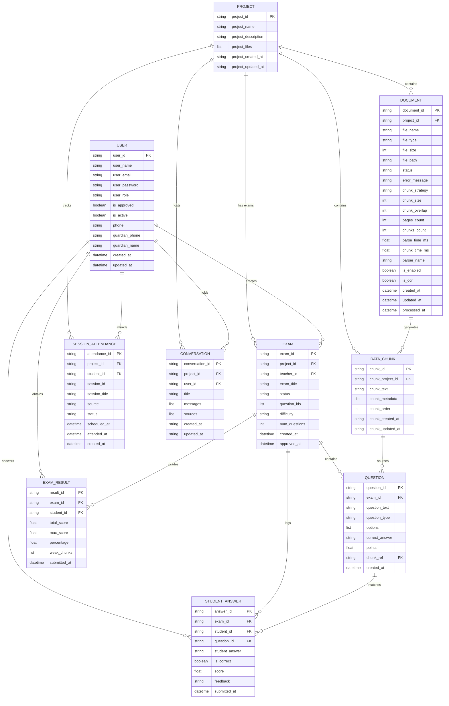

# Satr Edu AI: Enterprise-Grade Technical Documentation (Part 2/4)

This is Part 2 of the enterprise-grade technical documentation for **Satr Edu AI**. It details the database architecture, document ingestion pipeline, multi-layer OCR execution, vector search integration, and the Retrieval-Augmented Generation (RAG) system.

---

# 7. Database Architecture

Satr Edu AI operates on a hybrid database architecture optimized for both transactional integrity (MongoDB) and low-latency high-dimensional search (Qdrant).



---

## 7.1. MongoDB Schema Design & Indexing Strategy

MongoDB serves as the source of truth for user accounts, educational entities, metadata, logs, and sparse keyword vectors. We utilize `motor` (an asynchronous MongoDB driver) along with Pydantic schemas under `src/models/scheme_db/`.

### 1. User Collection (`users`)
- **Purpose**: Stores authentication credentials, system access roles, operational approval toggles, and metadata for communication channels.
- **Fields**:
  - `user_id` (str, PK): Unique identification string (typically UUID).
  - `user_name` (str): Full display name.
  - `user_email` (str): Primary email address used as login username.
  - `user_password` (str): Password hash, generated using `bcrypt`. Kept private and excluded from client serialization.
  - `user_role` (str): Access role, mapped to `UserRole` enum (`student`, `teacher`, `admin`).
  - `is_approved` (bool): Admin-controlled gatekeeping flag, particularly for teachers to limit access before verification.
  - `is_active` (bool): Deactivation switch to disable accounts without deleting histories.
  - `phone` (str): Target phone number for WhatsApp reminders (+CountryCode).
  - `guardian_phone` (str): Target phone number for guardian emergency notifications.
  - `guardian_name` (str): Identification name for the student's guardian.
  - `created_at` (datetime) / `updated_at` (datetime).
- **Index Plan**:
  - Unique Index on `user_email` (ASC) for fast authorization lookups.
  - Single field Index on `user_id` (ASC) for user profiling operations.
  - Index on `user_role` (ASC) for administrative role-based queries.

### 2. Document Collection (`documents`)
- **Purpose**: Manages metadata, file locations, extraction settings, and indexing states of uploaded files.
- **Fields**:
  - `document_id` (str, PK): Unique tracking ID.
  - `project_id` (str, FK): Identifier linking the file to a specific subject/course workspace.
  - `file_name` (str): Original filename.
  - `file_type` (str): Extension (e.g. `.pdf`, `.docx`, `.png`).
  - `file_size` (int): Raw storage size in bytes.
  - `file_path` (str): Absolute file location on the system disk or storage engine.
  - `status` (str): state tracking (`uploaded`, `processing`, `processed`, `indexed`, `failed`).
  - `chunk_strategy` (str): active text subdivision logic (`naive`, `structure`, `semantic`).
  - `chunk_size` (int) / `chunk_overlap` (int): splitter configuration constraints.
  - `pages_count` (int): Number of pages detected.
  - `chunks_count` (int): Total generated sub-chunks.
  - `parse_time_ms` (float) / `chunk_time_ms` (float): performance metrics.
  - `is_ocr` (bool): Indication flag if a scanned document fallback was activated.
  - `is_enabled` (bool): User-controlled toggler to disable a document from vector context selection.
- **Index Plan**:
  - Unique Index on `document_id`.
  - Single-field Index on `project_id` for directory listings.
  - Composite Index on `project_id` and `status` to filter operational backlogs.

### 3. Chunk Collection (`chunks`)
- **Purpose**: Holds extracted plain-text fragments for granular document reference and keyword indexing.
- **Fields**:
  - `chunk_id` (str, PK): Composite identifier containing `{project_id}_{file_id}_{order}`.
  - `chunk_project_id` (str, FK): Parent project ID.
  - `chunk_text` (str): Extracted clean text block.
  - `chunk_metadata` (dict): Context mappings (source file, pages, headers).
  - `chunk_order` (int): Sequence coordinate inside the parent document.
- **Index Plan**:
  - Index on `chunk_id` for individual retrieval.
  - Index on `chunk_project_id` to filter chunks during full-project indexing sweeps.
  - **Text Index** on `chunk_text` with `default_language="none"` configuration. This is critical: it supports combined Arabic/English keyword retrieval (`$text` searches) by disabling default English-centric language rules, avoiding parser damage to Arabic word forms.

### 4. Exam Collection (`exams`)
- **Purpose**: Manages testing templates, active evaluations, and parameter limits.
- **Fields**:
  - `exam_id` (str, PK): Unique identification.
  - `project_id` (str, FK): Context project linking target material.
  - `teacher_id` (str, FK): Identifier of the teacher creator.
  - `status` (str): State mapping (`draft`, `approved`).
  - `question_ids` (List[str]): References to individual children questions.
  - `difficulty` (str): Configured ceiling difficulty (`easy`, `medium`, `hard`, `mixed`).
  - `num_questions` (int): Size limit for generated tests.
- **Index Plan**:
  - Unique Index on `exam_id`.
  - Reference Index on `project_id`.
  - Reference Index on `teacher_id`.

### 5. Question Collection (`questions`)
- **Purpose**: Individual assessment items populated by teachers or automatically generated by the Exam engine.
- **Fields**:
  - `question_id` (str, PK): Unique tracking string.
  - `exam_id` (str, FK): Associated parent exam.
  - `question_text` (str): Prompts or text content.
  - `question_type` (str): Target format (`MCQ`, `TRUE_FALSE`, `ESSAY`).
  - `options` (List[str], optional): Multiple choice options.
  - `correct_answer` (str): Plain-text ground-truth answer.
  - `points` (float): Points value.
  - `chunk_ref` (str, optional): Target source chunk ID used for grounding and mapping weakness highlights.
- **Index Plan**:
  - Unique Index on `question_id`.
  - Index on `exam_id` to bulk retrieve questions during quiz initialization.

### 6. Student Answer Collection (`student_answers`)
- **Purpose**: Permanent tracking of individual question responses.
- **Fields**:
  - `answer_id` (str, PK): Unique ID.
  - `exam_id` (str, FK): Associated exam.
  - `student_id` (str, FK): Associated student.
  - `question_id` (str, FK): Target question.
  - `student_answer` (str): Submissions string.
  - `is_correct` (bool, optional): Correctness indicator (evaluated directly or via RAG grading).
  - `score` (float, optional): Awarded point fraction.
  - `feedback` (str, optional): LLM justification text, specifically for grading essay formats.
- **Index Plan**:
  - Unique Index on `answer_id`.
  - Composite Index on `exam_id` and `student_id` to pull full student answer sheets.

### 7. Exam Result Collection (`exam_results`)
- **Purpose**: Aggregate performance summaries per student per exam.
- **Fields**:
  - `result_id` (str, PK): Unique ID.
  - `exam_id` (str, FK) / `student_id` (str, FK).
  - `total_score` (float) / `max_score` (float).
  - `percentage` (float).
  - `weak_chunks` (List[str]): List of `chunk_ref` values where the student made mistakes.
- **Index Plan**:
  - Unique Index on `result_id`.
  - **Unique Composite Index** on `exam_id` and `student_id` to ensure a student is limited to exactly one aggregate grade entry per exam.

### 8. Session Attendance Collection (`session_attendance`)
- **Purpose**: Physical or digital class check-ins. Used by background workers to trace consecutive absences.
- **Fields**:
  - `attendance_id` (str, PK): Unique ID.
  - `project_id` (str, FK) / `student_id` (str, FK).
  - `session_id` (str): Session target.
  - `session_title` (str): Subject context.
  - `source` (str): Type marker (`session` | `exam`).
  - `status` (str): Attendance result (`present`, `absent`, `late`).
  - `scheduled_at` (datetime) / `attended_at` (datetime).
- **Index Plan**:
  - Unique composite index on `student_id`, `session_id`, and `source` to prevent duplicate attendance logs.
  - Index on `project_id` + `student_id` to count relative absences.
  - Index on `status` to list outliers.

### 9. Chat Conversation Collection (`conversations`)
- **Purpose**: Session state storage for Agentic interactions, permitting context memory persistence.
- **Fields**:
  - `conversation_id` (str, PK): Unique key.
  - `project_id` (str, FK) / `user_id` (str, FK).
  - `title` (str): Summarized conversation headline.
  - `messages` (List[ChatMessage]): Sequence of role (`user` | `assistant`) and content text.
  - `sources` (List[dict]): Metadata citations (files, snippets, page offsets) backing the last assistant answer.
- **Index Plan**:
  - Unique Index on `conversation_id`.
  - Composite Index on `user_id` and `project_id` to list historical chats in a user's dashboard.

---

## 7.2. Qdrant Vector Schema & Indexing Configuration

Qdrant handles high-dimensional semantic search. Instead of relational tables, Qdrant utilizes isolated collections.

### 1. Vector Collection Structure
- **Naming Rule**: Formatted as `collection_{vector_size}_{project_id}`.
  - `vector_size` matches the embedding dimension of the active model (e.g., `384` for `bge-small-en-v1.5`, `1536` for `text-embedding-3-small`, or `768` for Gemini's embedding API).
  - Isolating collections per project ID provides high performance and multi-tenant security: queries are physically partitioned at the database layer, eliminating cross-project vector interference.

### 2. Payload Structure
Every point indexed in Qdrant contains:
- **`id`**: Unique integer hash calculated from the chunk order.
- **`vector`**: Embedding float array.
- **`payload`**: JSON dictionary containing key parameters for RAG tracking:
  - `text`: Plain-text snippet block.
  - `chunk_id`: String mapping back to the MongoDB chunk collection.
  - `chunk_order`: Numeric order.
  - `source` / `source_file`: Absolute paths or filename reference.
  - `page`: Page index (0-based) where the text resides.

### 3. Vector Configuration Options
- **Distance Metric**: `Distance.COSINE`. This is standard for semantic retrieval as it measures directional orientation, normalizing for text length variations.
- **Indexing Options**: Default HNSW (Hierarchical Navigable Small World) configurations run in memory, enabling sub-millisecond retrieval on millions of items.

---

# 8. Document Processing Pipeline

The ingestion pipeline converts unstructured files (PDFs, DOCX, images) into indexed knowledge chunks.

```
Incoming Upload (API Route)
      │
      ▼
Save to Project Workspace (Disk Storage)
      │
      ▼
Enqueue Background Job (Celery Task)
      │
      ├─► Update MongoDB Status to "processing"
      │
      ▼
Text Extraction (Parser Factory Choice)
      ├─► PDF/DOCX/PPTX/HTML/JSON Raw Extraction
      └─► Scanned Page Check (Length < 50 chars) ──► Image Render ──► OCR Chain
      │
      ▼
Arabic Reconstruction (arabic-reshaper & python-bidi)
      │
      ▼
Document Chunking (Naive Recursive Split vs Smart DeepDoc Layout Segmentation)
      │
      ▼
Batch Ingress to MongoDB (Chunk Collection Bulk Write)
      │
      ▼
Vector Database Indexing Task
      ├─► Embed Clean Chunks (LLM Embedding Client)
      └─► Bulk Upsert to Qdrant Collection
      │
      ▼
Update MongoDB Status to "indexed" / Trigger SSE Success Event
```

---

## 8.1. Ingestion Pipeline Details

### 1. File Upload Phase
The client submits a file payload to `POST /api/v1/projects/{project_id}/documents/upload`.
- The route handler validates project integrity, reads the raw file stream, and writes it to a designated subdirectory: `data/projects/{project_id}/{file_name}`.
- A new entry is created in the MongoDB `documents` collection with status `"uploaded"`.

### 2. Task Delegation (Celery Execution)
Instead of processing the document synchronously and blocking the FastAPI event loop, the handler launches a Celery worker:
```python
task = process_file_task.delay(
    project_id=project_id,
    file_id=document_id,
    chunk_size=chunk_size,
    chunk_overlap=chunk_overlap,
    mongodb_url=settings.MONGODB_URL,
    mongodb_database=settings.MONGODB_DATABASE
)
```
The client immediately receives a `202 Accepted` response containing the `task_id`, allowing the frontend to poll status or display progress bars.

---

## 8.2. Text Extraction: The Parser Factory

The `ProcessController.get_file_loader` method uses a factory pattern to select the appropriate parser based on file extensions:

| File Extension | Target Loader | Execution Workflow |
| :--- | :--- | :--- |
| **`.txt`** | `TextLoader` | Direct file stream read. |
| **`.md`** | `UnstructuredMarkdownLoader` | Parses structural elements like headings and lists. |
| **`.html`** | `UnstructuredHTMLLoader` | Strips tags, scripts, and styling to retrieve content. |
| **`.docx`** | `UnstructuredWordDocumentLoader` | Extracts paragraphs and layouts from XML structures. |
| **`.pptx`** | `UnstructuredPowerPointLoader` | Extracts slide shapes, titles, and layouts. |
| **`.xlsx` / `.csv`** | CSV/Excel Loaders | Converts rows to structured context sentences. |
| **`.json`** | `UnstructuredJSONLoader` | Extracts keys and text values. |
| **`.pdf`** | `DirectPDFLoader` | Reads searchable text layers. Falls back to image rendering & OCR on scanning pages. |
| **`.png`, `.jpg`, `.jpeg`** | Image OCR Loader | Extracts text directly from image bytes. |

### PDF Text Extraction Details: `DirectPDFLoader`
The parser uses three python modules to safely retrieve PDF text without hanging:
1. **PyMuPDF (`fitz`)**: The primary extractor. Rapidly reads page text blocks. If character counts are sparse (< 50 characters per page), it switches to a block layout mode to recover misaligned formatting.
2. **`pdfplumber`**: Primary fallback if PyMuPDF fails or returns empty pages. It extracts text and table structures.
3. **`pypdf`**: Final pure-python fallback to extract text from simple structures.

---

## 8.3. Text Cleaning: Arabic Reconstruction

Arabic text in older or scanned PDF files is often garbled, reversed, or disconnected due to missing right-to-left layout maps. The system passes all extracted text blocks through the `fix_arabic_text` utility:
1. **`arabic_reshaper.reshape(text)`**: Combines letters depending on their position in the word (initial, medial, final, or isolated).
2. **`bidi.algorithm.get_display(reshaped)`**: Resolves right-to-left character sequencing, ensuring the final output matches standard Arabic reading order before embedding.

---

## 8.4. Chunking Strategies

The system supports two chunking engines:

### 1. Naive Recursive Splitting (`RecursiveTextSplitter`)
Used as a baseline for quick processing of unstructured files.
- It splits text recursively based on a prioritized separator list: `["\n\n", "\n", ". ", " ", ""]`.
- The splitter attempts to keep paragraphs (`\n\n`) intact. If a paragraph exceeds the target `chunk_size`, it splits on single lines (`\n`), then sentences (`. `), down to individual words to prevent text cutoff mid-sentence.

### 2. Structure-Aware Layout Splitting (`DeepDocController`)
Inspired by the **RAGFlow** pipeline. Instead of dividing text at fixed character counts, it parses layout blocks to keep contextual units intact:
- **Header Tracking**: Evaluates bold styling and font sizes via PyMuPDF dict trees, as well as regex headers (e.g. Arabic lists like `أولاً` or English numbering like `1.2 Title`). A detected header terminates the current chunk and starts a new one, prepending the heading title to ensure downstream search hits carry visual context.
- **Table Preservation**: Identifies table grids (via gridline coordinates or Markdown pipe tags `|`). It extracts the entire table block as a single, isolated chunk, preventing standard splits from separating rows or column values.
- **Bullet List Grouping**: Groups list sequences (lines beginning with bullets or numbers) into a single chunk.
- **Paragraph Grouping**: Combines standard paragraphs up to `chunk_size` limit, applying a configurable safety `chunk_overlap`.

---

# 9. OCR System Analysis

When documents are uploaded as scanned images or PDFs without searchable text layers, the system routes processing through a multi-stage, multi-language OCR fallback chain.

```
Image Input / Scanned PDF Page
      │
      ▼
1. Surya OCR (Local ML Model) ───────────────────► [Success] ──► Return Text
      │ (Failed / Not Installed)
      ▼
2. Gemini Vision API (Cloud Service) ────────────► [Success] ──► Return Text
      │ (Failed / Offline / No Key)
      ▼
3. DeepSeek OCR (Hosted Space API) ──────────────► [Success] ──► Return Text
      │ (Failed / Timeout)
      ▼
4. PaddleOCR (Local Python Wrapper) ─────────────► [Success] ──► Return Text
      │ (Failed / Out of Memory)
      ▼
5. Tesseract OCR (Last Resort Local Tool) ───────► Return Result (ara+eng or eng)
```

---

## 9.1. OCR Engine Fallbacks

### 1. Surya OCR
- **Type**: Local deep-learning layout analysis and OCR model.
- **Why it is preferred**: Excellent multilingual performance, specifically tuned for complex, column-based document layouts and accurate Arabic script recognition. It runs locally, avoiding cloud API costs.
- **Selection Criteria**: Selected as the default if CUDA-capable hardware (GPU) is available or CPU memory is sufficient.

### 2. Gemini Vision API
- **Type**: High-speed multimodal cloud API.
- **Why it is used**: Fast processing speeds (averaging under 2 seconds per page image) and high accuracy for handwritten text and low-resolution uploads.
- **Selection Criteria**: Serves as the primary cloud fallback if local hardware is limited or if the Surya parser is missing.

### 3. DeepSeek OCR
- **Type**: Secondary cloud fallback using Hosted Hugging Face Space APIs.
- **Why it is used**: Provides secondary redundancy to prevent ingestion pipeline failures if the Gemini service encounters rate limits or token exhaustion.

### 4. PaddleOCR
- **Type**: Local Python OCR framework.
- **Why it is used**: Lightweight local alternative. Performs well on single-line text and math equations.

### 5. Tesseract OCR
- **Type**: Standard open-source OCR engine.
- **Why it is used**: The final fallback. It has no external dependencies and runs locally.
- **Preprocessing pipeline**: Because Tesseract struggles with raw, low-contrast scans, `OCRController` preprocesses images before extraction:
  - Converts images to grayscale (`L` mode).
  - Enhances contrast by a factor of `2.0`.
  - Applies a sharpening filter.
  - Standardizes resolution: resizes images up to at least `1000px` using LANCZOS interpolation.
  - Binarizes the image using a static pixel threshold (`lambda p: 255 if p > 140 else 0`), converting the output to clear black text on white backgrounds.
  - Runs Tesseract with configuration flags `lang="ara+eng" --psm 6`, optimization settings for reading blocks of text, and a fallback to `lang="eng"` to handle pure English documents.

---

## 9.2. Performance & Cost Tradeoffs

| OCR Provider | Ingestion Cost | Speed (per page) | Setup Complexity | Arabic Accuracy |
| :--- | :--- | :--- | :--- | :--- |
| **Surya OCR** | $0 (Free) | 3 - 8 sec (CPU)<br>0.5 - 1.5 sec (GPU) | High (PyTorch, layout weights) | **Excellent** |
| **Gemini Vision**| Paid (per image) | 1 - 2.5 sec | Low (Needs API key) | **Excellent** |
| **DeepSeek OCR** | $0 (Rate-limited) | 2 - 5 sec | Low (API integration) | **Good** |
| **PaddleOCR** | $0 (Free) | 1 - 3 sec (CPU) | Medium | **Fair** |
| **Tesseract** | $0 (Free) | 2 - 4 sec | Medium (Requires bin path) | **Low** |

---

# 10. Vector Search Architecture

Vector search translates user queries into embeddings and matches them against database documents.

---

## 10.1. Embedding Generation
We support diverse embedding backends via the `EmbeddingClient` interface.
- **Local Model**: `sentence-transformers/all-MiniLM-L6-v2` or `bge-small-en-v1.5` running locally on Ollama.
- **Cloud Models**: `text-embedding-3-small` (OpenAI) or Gemini's `text-embedding-004`.
- **API Call Details**:
  - The client standardizes payload lists. In Qdrant, documents and queries are embedded using different prompt prefix formats to maximize retrieval accuracy.
  - When indexing: calls `embed_text` with type `DOCUMENT`.
  - When searching: calls `embed_text` with type `QUERY`.

---

## 10.2. Hybrid Retrieval Model: Combining Dense & Sparse Search

To prevent retrieval failures caused by synonyms or keyword mismatches, Satr Edu AI implements a **Hybrid Retrieval** system:

```
                  ┌──────────────────────┐
                  │      User Query      │
                  └──────────┬───────────┘
                             │
              ┌──────────────┴──────────────┐
              ▼                             ▼
   ┌────────────────────┐        ┌────────────────────┐
   │ Generate Vector    │        │ Raw Search Term    │
   └──────────┬─────────┘        └──────────┬─────────┘
              │                             │
              ▼                             ▼
   ┌────────────────────┐        ┌────────────────────┐
   │ Qdrant Dense Search│        │ MongoDB Sparse     │
   │ (Semantic Similarity)       │ (Text Index Search)│
   └──────────┬─────────┘        └──────────┬─────────┘
              │                             │
              └──────────────┬──────────────┘
                             ▼
                 ┌──────────────────────┐
                 │ Merge & Deduplicate  │
                 │ (by chunk_id mapping)│
                 └───────────┬──────────┘
                             │
                             ▼
                 ┌──────────────────────┐
                 │ Cross-Encoder        │
                 │ Reranking Model      │
                 └───────────┬──────────┘
                             │
                             ▼
                 ┌──────────────────────┐
                 │ Top-K Scored Chunks  │
                 └──────────────────────┘
```

### 1. Dense Semantic Retrieval (Qdrant)
- Processes queries through `search_by_vector`.
- Compares semantic representation (cosine similarity), matching conceptual intent even if the query and document use different vocabulary.

### 2. Sparse Keyword Retrieval (MongoDB)
- Queries MongoDB's `$text` index.
- Essential for matching specific jargon, code blocks, technical IDs, or exact names that are often diluted in high-dimensional vector embeddings.

### 3. Merging and Deduplication
The `MultiRetriever` combines the outputs of both searches:
- It maps results back to their primary `chunk_id` strings.
- Items are deduplicated, keeping the highest retrieval score to prevent redundant snippets from entering the LLM context window.

---

## 10.3. Cross-Encoder Reranking
After merging results, they are processed using a Cross-Encoder model (`cross-encoder/ms-marco-MiniLM-L-6-v2`):
- Unlike dense embeddings that compute query and document vectors independently, a Cross-Encoder processes both parameters simultaneously: `Pairs = [(query, document_text)]`.
- The model evaluates word alignment and syntax relationships to output a relevance score, scoring how well each document segment answers the query.
- Results are re-sorted based on the Cross-Encoder score, and the top $K$ chunks (defined by `RERANKER_TOP_K`) are passed to the RAG generator.

---

# 11. RAG Architecture

The Retrieval-Augmented Generation (RAG) system translates retrieved search chunks into factual answers, grounding the LLM's response in uploaded course materials.

---

## 11.1. Context Construction & Streaming

### 1. Template-Based Prompt Engineering
We use a structured template parser (`template_parser`) to construct prompts:
- **System Prompt**:
  ```markdown
  You are an expert academic tutor. You must answer the student's question using ONLY the provided text blocks.
  Follow these guidelines:
  1. Rely strictly on the provided documents. If the context does not contain the answer, say "I cannot find this in the course materials."
  2. Maintain academic integrity. Do not assume or extrapolate.
  3. Cite your sources using bracketed numbering [Doc X].
  ```
- **Context Prompt (Document Block)**:
  ```markdown
  --- DOCUMENT [Doc {doc_num}] ---
  Source: {source_file} (Page {chunk_order})
  {chunk_text}
  --------------------------------
  ```
- **Query Prompt**:
  ```markdown
  Student Question: {query}
  Tutor Answer:
  ```

### 2. Context Window Optimization
- Chunks are formatted sequentially. The system tracks token usage using `tiktoken` to prevent context truncation.
- If chat history is enabled, historic dialogue turns are appended before the context blocks to provide conversational memory.

---

## 11.2. Complete Request-to-Answer Lifecycle

```
[Student App] ──► Request Smart Ask Endpoint ──► [FastAPI Router]
                                                         │
                                                         ▼
[LLM Factory] ◄── [Orchestrator Agent] ◄─────── [Agent Controller]
      │                   │ (Classifies Intent)
      ▼                   ├─► Intent: tutor ──► Route to TutorAgent
[LLM Response]            └─► Retrieve Context:
 (Streaming SSE)                  │
                                  ├─► Generate Query Embedding
                                  ├─► Query Qdrant (Dense Search)
                                  ├─► Query MongoDB (Sparse Search)
                                  ├─► Merge & Deduplicate
                                  ├─► Run Cross-Encoder Reranker
                                  │
                                  ▼
[Student App] ◄── Stream SSE ◄── RAG Prompt Construction ◄── Top Chunks
```

### 1. Request Ingress
The student posts a query to `POST /api/v1/agent/smart-ask`.

### 2. Intent Classification & Routing
The `Orchestrator` uses the `IntentClassifier` to evaluate the user's intent. If classified as a context query (`tutor`), it routes execution to the `TutorAgent`.

### 3. Ingesting Context (RAG Pipeline)
1. The query text is embedded using the active embedding model.
2. The `MultiRetriever` executes parallel queries in Qdrant and MongoDB.
3. The results are merged, deduplicated, and passed to the Cross-Encoder Reranker.
4. The top $K$ document chunks are formatted into context blocks.

### 4. Generation & Citations Mapping
1. The structured prompt (system prompt + context chunks + query) is sent to the LLM.
2. The system maps source files and page numbers to document indices:
   ```json
   {
     "doc_num": 1,
     "source_file": "physics_lecture_1.pdf",
     "page": 4,
     "score": 0.8921
   }
   ```
3. The LLM streams the grounded answer using Server-Sent Events (SSE), appending the source mapping references so the frontend can highlight cited document segments.

---

> [!NOTE]
> This completes Part 2 (Sections 7-11). The system details of the database schemas, document ingestion pipelines, OCR fallbacks, vector databases, and RAG architectures have been fully documented.
> Please acknowledge to proceed to Part 3 (Sections 12-19: Multi-Agent System, Intent Classification, Agent Tools, Educational Features, Exam Engine, Analytics, Model Management, and Performance/Scalability).
