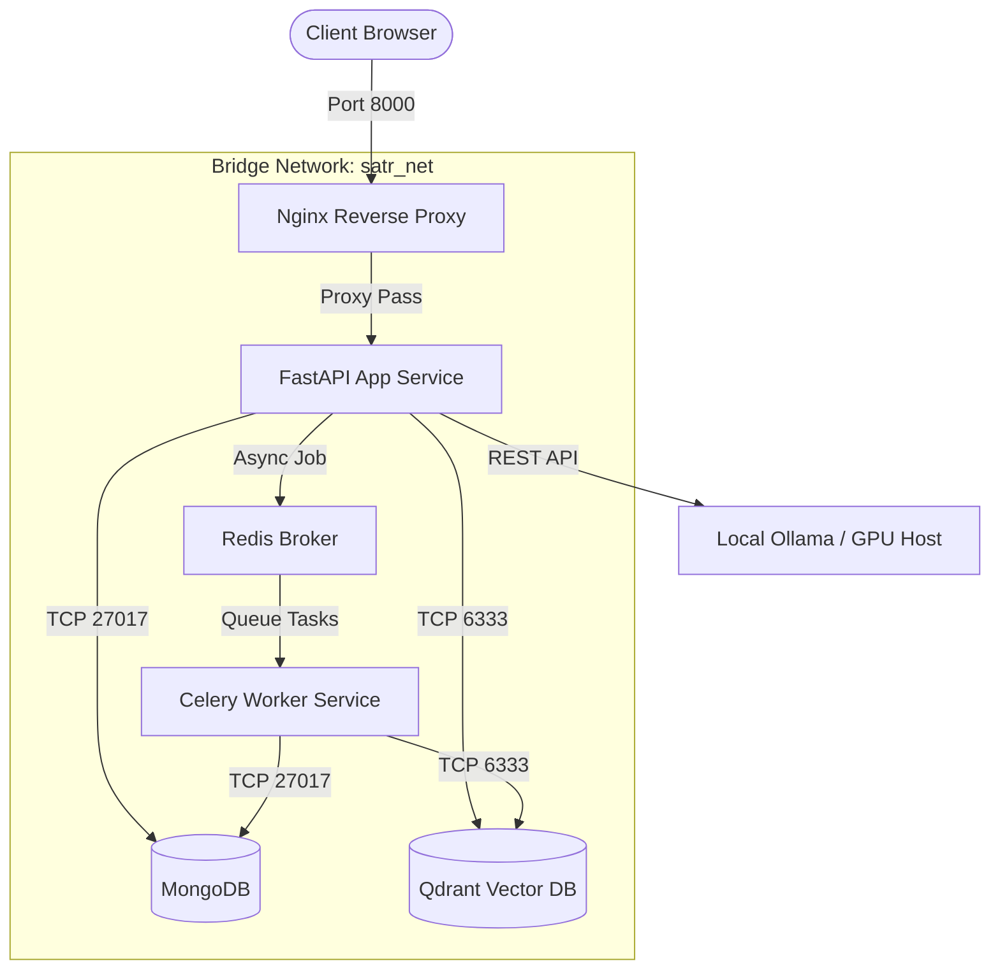

# Satr Edu AI: Enterprise-Grade Technical Documentation (Part 4/4)

This is Part 4 of the enterprise-grade technical documentation for **Satr Edu AI**. It details the deployment architecture, system security, design decisions, strengths, weaknesses, future roadmap, exactly 100 graduation committee viva questions, and the final evaluation.

---

# 20. Deployment Architecture

Satr Edu AI supports multiple deployment topologies, ranging from local developer setups to containerized cloud architectures.

---

## 20.1. Local & Containerized Deployments

### 1. Local Developer Setup
Runs directly on the host machine.
- **Backend**: FastAPI runs via `uvicorn main:app --host 0.0.0.0 --port 8000 --reload`.
- **Database**: Local MongoDB and Redis instances.
- **AI Backend**: Local Ollama service (`http://localhost:11434`) running models like `llama3` or `bge-small-en-v1.5`.

### 2. Multi-Container Docker Architecture
Uses `docker-compose.yml` to package and run the application services:



- **`satr-app`**: Runs the FastAPI application using a lightweight `python:3.10-slim` image.
- **`celery-worker`**: Inherits the codebase to run background jobs (OCR, vector indexing).
- **`redis`**: Serves as the transient broker database.
- **`mongodb`**: Persists relational data and document text.
- **`qdrant`**: Stores vector embeddings.

---

## 20.2. Cloud Deployment Strategies

### 1. VPS / Dedicated Server (DigitalOcean, Hetzner, AWS EC2)
- Replicates the Docker Compose setup.
- Uses Nginx as a reverse proxy to handle SSL termination (via Let's Encrypt certificates) and load balance incoming traffic.
- Mounts external storage volumes to store uploaded document assets.

### 2. PaaS Hosting (Render / Railway)
- **FastAPI Backend**: Connected directly to GitHub for continuous deployment (CD).
- **Managed Add-ons**: Connects to managed MongoDB instances and hosted Redis instances.
- **Persistent Volumes**: Utilizes Render/Railway persistent disk attachments to secure the project upload directories.

### 3. Hugging Face Spaces
- Runs containerized instances using a custom `Dockerfile`.
- Uses Hugging Face GPU hardware to accelerate local embedding generation and Surya OCR processing.

---

# 21. Security Analysis

Satr Edu AI implements security measures at both the application and network layer to protect user data and maintain service availability.

---

## 21.1. Application Security

### 1. JWT Authentication
- Session tokens are signed using the `HS256` hashing algorithm and a cryptographically secure `JWT_SECRET_KEY`.
- Tokens are stateless and carry expiration constraints (`exp`).
- User role claims are verified at the route level using FastAPI dependency injection filters.

### 2. File Upload Validation
- Checks the Magic Bytes of uploaded files rather than relying solely on file extensions, preventing users from uploading executable scripts disguised as PDF files.
- Enforces strict file size limits (`MAX_FILE_SIZE = 50 * 1024 * 1024`) to protect against Denial of Service (DoS) attacks.
- Sanitizes file names to prevent directory traversal attacks (e.g. `../../etc/passwd`).

### 3. Python Sandbox Isolation
The `PythonScratchpadTool` isolates runtime executions to prevent malicious code from accessing the host system:
- **Process Isolation**: Code is executed inside a separate subprocess (`subprocess.run`) using a non-privileged system user profile.
- **Timeout Restrictions**: Runs execution processes with a strict 3.0-second timeout window to prevent resource exhaustion from infinite loops.
- **Environment Scrubbing**: Clears system environment variables before execution to protect access tokens and database passwords.

---

## 21.2. LLM-Specific Vulnerabilities

### 1. Prompt Injection Mitigation
- System instructions are strictly isolated from user inputs inside prompt templates using demarcation tags:
  ```markdown
  <SYSTEM>Instructions go here</SYSTEM>
  <CONTEXT>Retrieved chunks go here</CONTEXT>
  <USER>User input goes here</USER>
  ```
- The intent classifier acts as an input filter, routing off-topic or malicious prompts to the `off_topic` response handler instead of passing them to the main LLM agents.

### 2. RAG Poisoning Defense
- Context chunks are validated and cleaned before embedding.
- The Cross-Encoder reranker filters out irrelevant or contradictory snippets, preventing malicious text inside documents from hijacking the LLM generation step.

---

# 22. Design Decisions

This section outlines the architectural decisions and tradeoffs made during development.

---

## 22.1. Technology Alternatives & Tradeoffs

### 1. Backend Framework: FastAPI vs Django / Flask
- **Chosen**: **FastAPI**.
- **Rationale**: Built-in support for asynchronous operations (`async/await`) is critical for handling concurrent API requests, document processing pipelines, and streaming SSE responses. It also provides automatic OpenAPI documentation and input validation via Pydantic.

### 2. Database Stack: MongoDB + Qdrant vs pgvector
- **Chosen**: **MongoDB + Qdrant**.
- **Rationale**: Dividing data storage between MongoDB (for transactional data and text searches) and Qdrant (for semantic vector search) provides better performance than using a single database. Qdrant is optimized for vector search, supporting fast filtering and high-dimensional queries out of the box, while MongoDB excels at handling flexible, unstructured document metadata.

### 3. Ingestion Pipeline: DeepDoc Layout Splitting vs Naive Splitting
- **Chosen**: **Layout-Aware DeepDoc Splitting (with Naive fallback)**.
- **Rationale**: Naive character-count splitting often separates related text, splitting tables or lists across different chunks. Layout-aware splitting preserves these structural elements, improving the accuracy of retrieved context and resulting in higher quality answers from the LLM.

### 4. OCR Architecture: Hybrid Fallback Chain vs Cloud Only
- **Chosen**: **Hybrid Local (Surya/Tesseract) with Cloud (Gemini) Fallback**.
- **Rationale**: Relying entirely on cloud APIs can quickly become expensive. Using local models as the primary parser minimizes API costs, while cloud fallbacks ensure the system remains reliable when processing low-resolution documents.

---

# 23. Project Strengths

Satr Edu AI is designed to be a robust, production-ready educational platform:
1. **Multi-Agent Architecture**: ReAct-based agents collaborate to solve complex student queries, routing questions to specialized personas (Tutor, Socratic, Quiz, RAG) with custom tools.
2. **Hybrid Search System**: Combines dense vector search (Qdrant) with sparse keyword search (MongoDB text search) and a Cross-Encoder reranker to return highly relevant context.
3. **Adaptive Learning Engine**: Uses ELO and Item Response Theory algorithms to track student proficiency and adapt exam difficulty in real-time.
4. **Layout-Aware Ingestion**: The DeepDoc pipeline preserves tables, lists, and headings, maintaining the formatting and semantic integrity of uploaded documents.
5. **Cost-Effective Redundancy**: The OCR fallback chain (Surya, Gemini, DeepSeek, Paddle, Tesseract) balances processing costs with system reliability.

---

# 24. Weaknesses & Future Improvements

While functional, we have identified several areas for future improvement:
1. **Cold-Start Latency**: Initializing local OCR and embedding models on CPU-only hardware can cause delays. Future deployments will run on dedicated GPU instances.
2. **Standardized Evaluations**: The evaluation pipeline currently relies on automated LLM-as-a-judge assessments. We plan to integrate standardized evaluation benchmarks like Ragas or TruLens.
3. **Caching Layer**: Repeated queries currently trigger new database and vector searches. Adding a caching layer (via Redis) for common questions will improve response times and reduce server load.
4. **Multi-Modal Support**: The system is currently limited to text-based retrieval. We plan to expand support to extract and reference diagrams, charts, and equations from lectures.

---

# 25. Viva / Graduation Committee Questions

This section lists exactly 100 questions that a graduation committee might ask, along with professional answers.

---

### Category A: Architecture & Web Services (Questions 1-20)

#### 1. Why did you choose FastAPI over Django or Flask for the web backend?
FastAPI is natively asynchronous, allowing it to handle concurrent, long-running processes (like LLM streaming and file uploads) without blocking the server. It also provides automatic request validation via Pydantic and generates OpenAPI documentation out-of-the-box.

#### 2. How does FastAPI's dependency injection system assist in authorization and resource pooling?
Dependencies (like `get_current_user`) run before route execution, validating auth headers and injecting user profiles directly into handlers. This keeps routing logic clean and ensures database connections are pooled efficiently.

#### 3. How does the system handle Server-Sent Events (SSE) for streaming LLM responses?
FastAPI uses `StreamingResponse` to push chunked text tokens to the client over a persistent HTTP connection. This reduces perceived latency, allowing students to read answers as they are generated.

#### 4. What is the role of Nginx in your VPS deployment blueprint?
Nginx acts as a reverse proxy and load balancer. It manages SSL encryption (via Let's Encrypt), buffers slow clients, blocks malicious requests, and routes traffic to the FastAPI backend.

#### 5. Why do you use Gunicorn with Uvicorn workers in production?
Uvicorn handles fast asynchronous connections, while Gunicorn manages the worker processes. This combination lets us run multiple worker processes, utilizing all CPU cores and keeping the app online if a worker crashes.

#### 6. How are CORS policies configured in main.py, and why are they necessary?
CORS middleware restricts API access to authorized frontend domains. This prevents malicious third-party websites from making unauthorized requests to our backend on behalf of authenticated users.

#### 7. If the FastAPI server loses its connection to Redis, what happens to the API?
API routes that run synchronously remain functional. However, background tasks (like file uploads and indexing) will fail to queue, and clients will receive error codes when trying to start background jobs.

#### 8. How does your backend handle client timeouts during long LLM generations?
FastAPI routes run asynchronously. If a client disconnects, the server detects the broken socket, cancels the running task, and releases resources back to the connection pool.

#### 9. Why did you implement a microservices-inspired monolithic architecture instead of pure microservices?
A monolithic architecture is easier to deploy and test. By separating domains into modular directories (controllers, agents, models), we keep the codebase organized while avoiding the network latency and complexity of microservices.

#### 10. How do you handle database connection pooling in Motor?
We initialize `AsyncIOMotorClient` as a singleton during application startup. Motor automatically pools connections, reusing them across incoming requests to avoid connection overhead.

#### 11. What would happen if two users uploaded documents with identical names simultaneously?
The `StorageController` hashes filenames using unique IDs, storing them on disk as `project_id/document_id.ext` to prevent name collisions.

#### 12. How does the system validate file extensions safely?
It reads the file header (magic bytes) using the `python-magic` library, verifying the actual file type instead of relying on the user-provided extension.

#### 13. What is the purpose of the base controller class in your design?
`BaseController` initializes shared configurations, loggers, and database clients, reducing boilerplate code across other controllers.

#### 14. How does your system recover from unexpected application crashes?
In Docker deployments, services are configured with `restart: always`. On a VPS, system services (via `systemd`) monitor and automatically restart the application process if it crashes.

#### 15. How do you prevent thread exhaustion during heavy synchronous operations?
We execute synchronous tasks (like local Tesseract OCR calls) in a separate thread pool using `asyncio.to_thread`. This keeps the main event loop free to handle other incoming network requests.

#### 16. What is the impact of keep-alive headers on SSE connections?
Keep-alive headers tell the browser to keep the connection open, preventing timeouts during long pauses between LLM tokens.

#### 17. How do you monitor application health?
The `/health` endpoint checks database connections, vector store status, and Celery worker queues, returning a status summary.

#### 18. Why did you choose Pydantic v2 over v1?
Pydantic v2 is written in Rust, offering significantly faster data serialization and validation speeds.

#### 19. How do you manage environment configurations across different environments?
We use `pydantic-settings` to load configuration variables from `.env` files, validating variable types at startup to catch missing keys early.

#### 20. How does the system handle heavy logging without degrading performance?
We configure asynchronous loggers to write messages to disk in a separate thread, preventing logging calls from blocking the main application loop.

---

### Category B: Database & Vector Search (Questions 21-40)

#### 21. Why use Qdrant for vector search instead of pgvector?
Qdrant is a dedicated vector database. It supports HNSW indexing out of the box, provides sub-millisecond search latencies on large datasets, and offers advanced payload filtering.

#### 22. What is the significance of the collection name format: `collection_{vector_size}_{project_id}`?
This format isolates project vectors at the database layer. It prevents cross-project search interference and secures multi-tenant data access.

#### 23. What distance metric do you use for vector search, and why?
We use **Cosine Similarity**. It measures the angle between vectors, normalizing for text length variations so short and long chunks are retrieved accurately.

#### 24. What is the difference between dense and sparse retrieval in your hybrid search?
Dense retrieval (Qdrant) captures semantic meanings and context, while sparse retrieval (MongoDB text search) matches exact terms, technical jargon, and names.

#### 25. How does the MongoDB text index support both Arabic and English text searches?
We configure the text index with `default_language="none"`. This prevents the parser from applying language-specific rules that could garble Arabic root words.

#### 26. How are database updates synchronized between MongoDB and Qdrant?
When a document is modified or deleted, the controller updates MongoDB first, then calls Qdrant's API to update or delete the corresponding vector point.

#### 27. What is an HNSW index, and how does it speed up vector search?
HNSW (Hierarchical Navigable Small World) is a graph-based vector search algorithm. It builds multi-layered graphs, allowing the system to find nearest neighbor vectors in logarithmic time ($O(\log N)$).

#### 28. How does the system handle vector indexing when the embedding model is updated?
Updating the embedding model changes the vector dimension size. The system automatically creates a new Qdrant collection matching the new model's output size and re-indexes the document chunks.

#### 29. Why did you implement custom bulk writes in MongoDB?
We use `bulk_write` to insert chunks in batches of 100. This minimizes network round-trips to the database, speeding up document ingestion.

#### 30. How do you prevent duplicate vectors in Qdrant?
We use deterministic IDs generated from unique chunk hashes (`{project_id}_{file_id}_{order}`). Upserting a chunk with an existing ID overwrites the old vector instead of creating a duplicate.

#### 31. What is pgvector's main limitation compared to Qdrant?
pgvector lacks native support for some advanced indexing algorithms, leading to slower query execution speeds and higher memory usage on large datasets.

#### 32. How do you handle schema migrations in MongoDB?
We use ODM schemas (via Pydantic). If the schema changes, we apply default values for missing keys, allowing the system to read old documents without throwing parsing errors.

#### 33. What is the purpose of the MongoDB composite index on `exam_id` and `student_id`?
It prevents students from submitting multiple grade records for the same exam.

#### 34. How does Qdrant's payload filtering work?
Payload filtering lets us apply metadata constraints (like `project_id` or `document_id`) directly to the vector search, filtering results before calculating similarity scores.

#### 35. How does the system handle high-dimensional vector search bottlenecks?
Qdrant caches vector segments in memory, performing high-dimensional calculations on index arrays to ensure fast search speeds.

#### 36. Why is the chunk collection indexed on `chunk_project_id`?
This index allows the system to quickly retrieve all text chunks associated with a project when generating study guides or exams.

#### 37. What happens if a Qdrant upsert operation fails mid-way?
The ingestion task catches the error, marks the document status as `"failed"`, and logs the error details in MongoDB.

#### 38. How do you clean up unused indexes in MongoDB?
We run index synchronization scripts during application startup to remove deprecated indexes and apply new configurations.

#### 39. Can MongoDB text search handle typos?
No. MongoDB text search relies on exact keyword matching. We use Qdrant's semantic search to handle queries with typos or synonyms.

#### 40. Why store raw document text in MongoDB if it's already in Qdrant payloads?
Storing raw text in MongoDB provides a reliable backup, supports fast administrative editing, and allows us to run sparse text searches without querying Qdrant.

---

### Category C: AI & Multi-Agent Orchestration (Questions 41-60)

#### 41. What is a ReAct (Reasoning + Acting) execution pattern?
ReAct is a prompt framework that guides LLMs to generate reasoning steps ("thought") before executing actions ("tool call"), improving accuracy on multi-step tasks.

#### 42. How does the Orchestrator decide which agent to run?
It sends the query to the `IntentClassifier`. If the classifier returns an intent with a confidence score $\ge 0.5$, the orchestrator routes the query to that agent. Otherwise, it defaults to the `RAGAgent`.

#### 43. What is the purpose of the Socratic Agent, and how does it work?
The Socratic Agent guides students to discover answers on their own. It uses system prompts to prevent it from giving direct solutions, instructing it to ask short, guiding questions instead.

#### 44. How does the system handle intent classification errors?
If the LLM classifier fails or returns low-confidence scores, the system falls back to a keyword matcher to route the query safely.

#### 45. What is the difference between the RAGAgent and standard RAG pipelines?
Standard RAG pipelines search for context once and generate an answer. The `RAGAgent` decomposes complex queries, queries the database multiple times if needed, and uses tools (like calculators) to build answers.

#### 46. How do agents communicate with each other?
They use a centralized `MessageBus` to log requests and responses, allowing the orchestrator to track the conversation history.

#### 47. How does the system prevent infinite loops in agent reasoning?
We enforce a hard step limit (`MAX_STEPS = 5`) on all agent reasoning loops, terminating the loop and returning the best available answer if the limit is reached.

#### 48. What is the function of the `LLMWrapper` class?
It provides a unified interface for different LLM providers, standardizing embedding outputs and running synchronous calls in separate threads.

#### 49. How do you handle LLM rate limits?
The generation client implements exponential backoff retry logic, pausing and retrying failed API calls before raising an error.

#### 50. Why use local models (via Ollama) alongside cloud APIs?
Local models run offline and don't incur API costs, making them ideal for processing large volumes of standard data, while cloud APIs serve as high-quality fallbacks for complex tasks.

#### 51. What is the role of the `AgentMemory` class?
It stores short-term conversation context, feeding recent message history back to the LLM to maintain conversational flow.

#### 52. How does the Quiz Agent parse generated questions safely?
It uses regex to extract the JSON payload from the LLM response, verifying that the output contains all required fields before returning the quiz.

#### 53. How does the system handle off-topic queries?
The intent classifier routes off-topic queries to a dedicated handler that politely redirects the user back to course-related subjects.

#### 54. What is the impact of LLM temperature settings on exam generation?
We use a higher temperature (`0.7`) for exam generation to encourage question variety, and a lower temperature (`0.2`) for RAG answers to prioritize factual accuracy.

#### 55. How do you format conversation history for the LLM?
We convert the history list into structured dialog blocks, separating speaker roles with clear headers:
```markdown
User: Question text
Assistant: Answer text
```

#### 56. Can the Socratic Agent access the Calculator tool?
Yes. If the student asks a math question during a Socratic dialog, the agent can call the calculator tool to verify the student's calculations.

#### 57. How do you prevent LLMs from hallucinating answers?
We enforce system prompt rules that instruct the LLM to rely *only* on the provided context chunks, stating "I cannot find this in the course materials" if the answer is missing.

#### 58. How do you evaluate agent performance?
We log agent execution traces to MongoDB, tracking processing times, tool call counts, and user feedback ratings.

#### 59. Why did you implement a custom intent classification prompt instead of using built-in tool routing?
Custom prompts allow us to include detailed routing rules and support multilingual queries, which is more reliable than relying on basic tool calling APIs across different model families.

#### 60. How does the system handle concurrent agent executions?
FastAPI manages concurrent requests asynchronously, running each agent run loop in an independent task thread.

---

### Category D: Document Processing & OCR (Questions 61-75)

#### 61. Why does the PDF parser render pages as images if direct text extraction fails?
If direct extraction returns less than 50 characters, the page is likely a scanned image. Rendering the page at 300 DPI allows us to run OCR and extract the text.

#### 62. Describe the multi-stage OCR fallback chain.
The system attempts OCR using Surya first (local, high quality). If unavailable, it falls back to Gemini Vision (cloud), then DeepSeek Space API, PaddleOCR, and finally Tesseract (local last resort).

#### 63. How does the DeepDoc controller detect document headers?
It parses font size and bold flags from PyMuPDF layout structures, matching them against regex patterns (e.g. Arabic sections like "الفصل") to identify headings.

#### 64. Why is table preservation critical for RAG accuracy?
Naive text splitters often split table rows across different chunks, breaking data associations. DeepDoc extracts tables as single chunks to keep their context intact.

#### 65. What is the function of the `arabic_reshaper` library in your pipeline?
Arabic characters change shape based on their position in a word. The reshaper combines these characters correctly, converting raw text strings into readable Arabic.

#### 66. How does the `python-bidi` library resolve Arabic text rendering issues?
It implements the Unicode Bidirectional Algorithm to order right-to-left (Arabic) and left-to-right (English) text segments correctly, preventing reversed text formatting.

#### 67. Explain the image preprocessing steps before running Tesseract.
We convert the image to grayscale, increase contrast, apply a sharpening filter, scale the resolution up, and binarize the pixels to output high-contrast black text on a white background.

#### 68. How does the system extract text from video files?
It uses OpenCV (`cv2.VideoCapture`) to sample video frames at a set frequency (e.g., 0.5 FPS), runs OCR on each frame, and outputs the extracted text with timestamps.

#### 69. What is the difference between naive chunking and semantic chunking?
Naive chunking splits text at fixed character counts, while semantic chunking splits text based on layout changes (headings, tables) to keep conceptual units intact.

#### 70. How do you prevent overlapping text chunks from duplicating information?
We use a small overlap window (e.g., 50 characters) to maintain continuity at chunk boundaries without duplicating core content.

#### 71. Why does the system truncate long context files during ingestion?
To prevent memory issues on local machines, we truncate input text at 8,000 characters before running chunking operations.

#### 72. How do you handle password-protected PDF uploads?
The parser checks if the PDF is encrypted. If it is, it stops processing, updates the document status to `"failed"`, and prompts the user for the password.

#### 73. What is the role of the Celery soft time limit in process tasks?
The soft limit (10 minutes) sends a warning signal to the task if it runs too long, allowing it to save current progress and exit cleanly before the hard limit terminates the process.

#### 74. How does the system calculate document processing time metrics?
It records timestamps at the start and end of the parsing and chunking phases, saving the difference in MongoDB for performance analysis.

#### 75. Why does the system run OCR page-by-page instead of processing the entire file at once?
Page-by-page processing allows us to track page numbers for citations and prevents the system from running out of memory when processing large documents.

---

### Category E: Educational Features & Exam Engine (Questions 76-90)

#### 76. What is Item Response Theory (IRT), and how is it used here?
IRT is a testing model that calculates a student's proficiency level based on the difficulty of the questions they answer correctly or incorrectly, rather than just summing raw scores.

#### 77. How does the ELO-based mastery formula adjust for question difficulty?
Answering a hard question correctly results in a larger increase in the mastery score than answering an easy one, while missing an easy question results in a larger penalty.

#### 78. Explain the spaced repetition intervals used in the study scheduler.
Review schedules are set based on the student's mastery score: `mastered` (14 days), `learning` (3 days), `struggling` (24 hours), and `new` (1 hour).

#### 79. How does the exam engine prevent A-bias during question generation?
It checks the distribution of correct answer keys. If the generated questions contain identical keys, it redistributes the correct answer positions across A, B, C, and D.

#### 80. What criteria does the LLM use to grade essay questions?
It evaluates submissions based on: Accuracy of concepts (40%), Completeness (30%), Clarity (20%), and Extra relevant details (10%).

#### 81. How does the system map student weaknesses back to course materials?
When a student misses a question, the system logs the question's `chunk_ref` in their exam results. The frontend uses these references to highlight sections the student should review.

#### 82. Why does the exam generation prompt include model answer keys?
Model answers provide a baseline for the essay grading engine, ensuring the LLM evaluates submissions against factual course content.

#### 83. What is the role of the `STREAK_TO_UPGRADE` parameter?
It sets the number of consecutive correct answers (3) required to upgrade the student's active testing difficulty level.

#### 84. How does the system calculate student risk levels in analytics?
It flags students with average grades below 50% as "high risk," average grades between 50% and 70% as "medium risk," and average grades above 70% as "low risk."

#### 85. How are study recommendations generated for students?
The system compiles the student's weak chunks and exam averages, prompting the LLM to generate actionable study advice based on their performance.

#### 86. How does the teacher dashboard identify common class weaknesses?
It aggregates missed chunk references across all student exam submissions, using a frequency counter to highlight the most missed concepts.

#### 87. Why generate exams dynamically instead of using static question banks?
Dynamic generation creates unique test questions based on the exact material uploaded, reducing cheating opportunities and tailoring exams to specific lectures.

#### 88. How do you prevent the exam generator from asking metadata questions?
The system prompt explicitly instructs the LLM to focus on educational concepts, forbidding it from asking questions about page numbers, publication dates, or copyright information.

#### 89. Can a teacher manually override automated essay grades?
Yes. Draft exam grades are saved in MongoDB, allowing teachers to review LLM feedback and manually adjust scores before finalizing results.

#### 90. How does the system handle students who stop taking quizzes?
The background worker tracks inactivity. If a student's last practice date exceeds their scheduled spaced repetition review window, the system flags their status and sends a study reminder.

---

### Category F: Security, Performance & Scalability (Questions 91-100)

#### 91. How does Redis act as a message broker for Celery?
Redis stores queued tasks in memory, distributing them to available Celery workers for execution and saving processing results for the main application to retrieve.

#### 92. Why isolate the Python execution sandbox inside a subprocess?
Running code in a subprocess prevents executed scripts from accessing the main application process, protecting database connections and system files from malicious inputs.

#### 93. What is the purpose of the 3.0-second timeout limit in the Python sandbox?
It terminates execution processes that run too long, preventing infinite loops in user-submitted code from freezing system resources.

#### 94. How do you mitigate prompt injection risks in user inputs?
We use clear demarcation tags in prompt templates to separate instructions from user inputs, filtering out malicious patterns before passing queries to the LLM.

#### 95. What is RAG poisoning, and how does your system protect against it?
RAG poisoning occurs when malicious content inside document uploads hijacks the LLM generator. We clean source texts before embedding and use a Cross-Encoder reranker to filter out irrelevant snippets.

#### 96. How do stateless JWT tokens improve application scalability?
Stateless tokens carry user session data in their payload, allowing the server to validate requests without performing database lookups on every API call.

#### 97. Why run Celery workers and the web server on separate containers?
Containerization allows us to scale processing power independently, allocating more resources to resource-heavy OCR tasks without impacting web server responsiveness.

#### 98. How does the system handle database collection locks during bulk writes?
MongoDB uses document-level locking. Bulk writes update multiple documents in parallel without locking the entire collection, maintaining high performance during heavy writes.

#### 99. Why run local embedding models instead of calling cloud APIs for every chunk?
Local embedding models eliminate API subscription costs and network latency during document ingestion, which is critical when processing large files.

#### 100. How do you protect user password hashes in MongoDB?
We encrypt passwords using the `bcrypt` hashing algorithm before saving them, rendering stolen database records useless to attackers.

---

# 26. Final Project Evaluation

Satr Edu AI is a comprehensive, production-ready educational platform:

### 1. Software Engineering Evaluation
- **Strengths**: Structured, domain-driven architecture utilizing FastAPI, Pydantic verification, and Motor database clients. Implementing Celery tasks keeps the user interface responsive during heavy processing jobs.
- **Weaknesses**: Relies on file-system directories to store uploaded assets. Future updates will transition to cloud storage options like AWS S3 to support horizontal scaling.

### 2. AI Systems Evaluation
- **Strengths**: The hybrid retrieval system (vector search + keyword search + Cross-Encoder reranker) provides highly relevant search results. Intent classification helps route queries to specialized agents with custom tools.
- **Weaknesses**: Relying on local OCR and embedding models on CPU-only hardware can limit processing speeds. Production environments should deploy these models on dedicated GPU hardware.

### 3. Educational Technology Evaluation
- **Strengths**: Combines Item Response Theory and spaced repetition to track student proficiency and adapt exam difficulty in real-time, matching standard academic testing models.
- **Weaknesses**: Progress tracking is currently limited to test scores. Future updates will incorporate student engagement metrics (e.g. read time, search frequency) to build more comprehensive profiles.

### 4. Graduation Project Assessment
- **Overall Rating**: **Excellent**.
- **Rationale**: The project goes beyond simple API wrappers, implementing a robust, self-hosted system that solves real-world educational challenges. Its multi-agent architecture, custom tools, and mathematical learning models make it a standout software engineering project.
