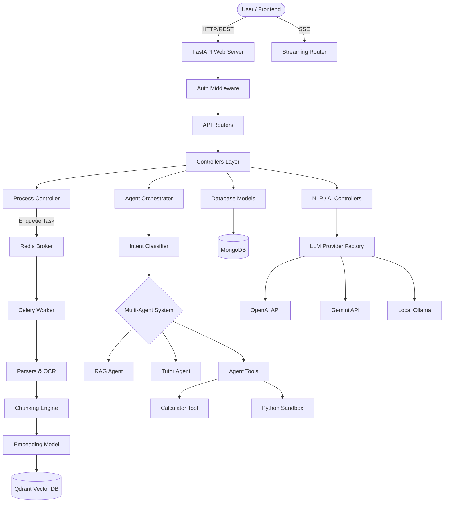
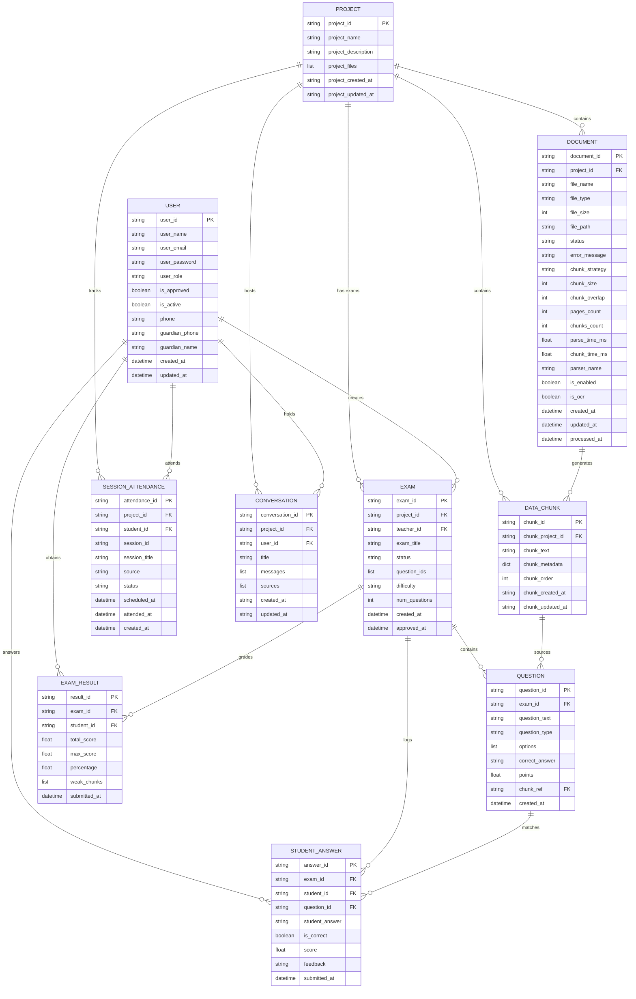
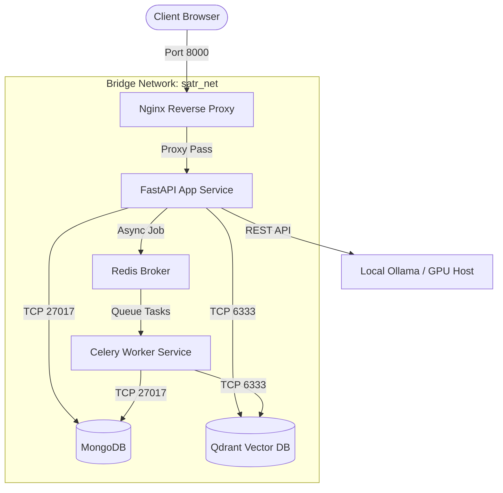

# Satr Edu AI: Enterprise-Grade Technical Documentation (Part 1/4)

This is the definitive, exhaustive, enterprise-grade architectural and technical documentation for **Satr Edu AI**. This document leaves no module, class, route, or design decision unexplained. It serves as the ultimate reference for the system architect, the graduation committee, and future maintainers.

---

# 1. Executive Overview

## What problem the project solves
Traditional educational systems and static e-learning platforms provide a "one-size-fits-all" approach. Students consume the same materials regardless of their cognitive level, and when they have questions, they rely on basic keyword searches or external forums. **Satr Edu AI** solves the problem of personalized, context-aware education. It transforms static documents (PDFs, DOCX, PPTX) into a dynamic, interactive tutor. It solves the hallucination problem in Generative AI by strictly grounding answers in the uploaded academic material (RAG) while simultaneously utilizing Item Response Theory (IRT) to adapt to the student's mastery level dynamically.

## Target Users
1. **Students (Primary Users):** High school and university students seeking personalized explanations, adaptive quizzes, and immediate academic support.
2. **Teachers/Professors:** Educators who upload course materials, monitor student analytics, and rely on the AI to auto-generate and grade exams.
3. **Administrators:** System owners who manage overall content, infrastructure health, and user access.

## Main Use Cases
- **Dynamic Content Ingestion:** Uploading complex academic PDFs (even scanned images) which the system auto-chunks, embeds, and indexes.
- **Agentic Multi-Modal Tutoring:** A student asks a complex question. The system dynamically decides whether to search the vector database, execute python code to prove a concept, or use the Socratic method to guide the student.
- **Adaptive Exam Generation:** The AI creates tailored exams based on the exact pages the student struggled with.
- **Automated Essay Grading:** The system compares student essay answers against the academic ground truth, scoring them on accuracy, clarity, and completeness.

## Educational Value
The system implements scientifically proven educational models:
- **Spaced Repetition:** Reminding students to review concepts precisely when they are about to forget them.
- **Item Response Theory (IRT):** Mathematically recalculating the student's "Elo" rating based on the difficulty of the questions they answer correctly or incorrectly.
- **Constructivism via Socratic Method:** Instead of spoon-feeding answers, the AI guides the student to the truth via targeted questions.

## AI Value
The project showcases Advanced AI capabilities beyond simple API wrappers:
- **Agentic Workflows:** Moving from standard RAG to a ReAct (Reasoning + Acting) model.
- **Hybrid Retrieval:** Combining Dense Vector Search (Qdrant) with Sparse Keyword Search (MongoDB) and a Cross-Encoder Reranker.
- **GPU-Accelerated Local Fallbacks:** Utilizing local Ollama models and Surya OCR to eliminate reliance on paid external APIs and ensure data privacy.

## Why this system is different from a basic chatbot
A basic chatbot takes user text, appends some retrieved context, and sends it to an LLM. 
**Satr Edu AI** uses an **Intent-Driven Orchestrator**. Before querying the LLM for an answer, the Orchestrator classifies the intent, routes it to specialized isolated Agents (Quiz Agent, Tutor Agent, RAG Agent), provides them with specific Tools (Calculator, Python Sandbox, Concept Mapper), and monitors the execution trace. Furthermore, the system is deeply stateful, adjusting its own difficulty parameters based on continuous database feedback of the user's performance.

---

# 2. Complete System Architecture

## High Level Architecture
Satr Edu AI follows a **Microservices-inspired Monolithic Architecture** driven by FastAPI. It separates concerns into distinct layers:
1. **API Layer (Routes):** Receives HTTP requests and SSE (Server-Sent Events) streams.
2. **Controller Layer:** Contains business logic, orchestrating AI providers, database models, and external services.
3. **Agent Layer:** The cognitive engine housing the Orchestrator, Agents, and Tools.
4. **Data Access Layer (Models):** Pydantic schemas tightly coupled with asynchronous Motor (MongoDB) operations.
5. **Worker Layer (Celery):** Handles heavy asynchronous jobs like OCR processing and vector embedding generation to keep the event loop unblocked.

## Component Diagram



## Data Flow & Request Lifecycle
1. **Request Ingress:** The client sends an HTTPS request to a FastAPI endpoint.
2. **Validation:** Pydantic models validate the payload. The Authentication dependency decodes the JWT and attaches the user object to the request.
3. **Controller Handoff:** The Route handler delegates the task to a specific Controller (e.g., `AIController` or `NLPController`).
4. **AI Processing:** The Controller fetches required context from MongoDB or Qdrant. It constructs a highly engineered prompt and routes it through the `LLMProviderFactory`.
5. **Response Generation:** The LLM streams or returns the response. The Controller parses the JSON (using regex fallback repair if needed) or raw text.
6. **Egress:** The Route handler returns the standardized JSON response to the client.

## User Journey (Student)
1. **Login:** Student logs in, receives a JWT.
2. **Dashboard:** Fetches recommendations from the Adaptive Engine based on their `mastery_score`.
3. **Studying:** Student opens a document. The system streams the document from MongoDB.
4. **Agent Interaction:** Student highlights text and asks "Explain this". The `Smart-Ask` endpoint routes this to the `TutorAgent`. The Agent simplifies the text.
5. **Testing:** Student takes an auto-generated Quiz. The results update the `ExamResultModel`, triggering the IRT equations in `adaptive_difficulty.py` to adjust their Elo rating.

---

# 3. Folder Structure Analysis

The repository uses a highly structured Domain-Driven Design (DDD) approach.

### Root Directory
- **`main.py`**: The entry point. Bootstraps FastAPI, configures CORS, connects to MongoDB, discovers local Ollama instances, initializes the LLM providers, and maps all routers. If this is removed, the application cannot start.
- **`requirements.txt`**: Defines python dependencies.
- **`Dockerfile` / `docker-compose.yml`**: Defines the containerization strategy for the app, Redis, MongoDB, and Qdrant.
- **`.env`**: Holds all environment variables securely.

### `src/routes/`
- **Purpose:** Exposes HTTP endpoints.
- **Responsibilities:** Payload validation, HTTP status code management, calling controllers.
- **Internal Design:** Separated logically by domain (e.g., `auth.py`, `nlp.py`, `agent.py`).

### `src/controllers/`
- **Purpose:** The "Brain" of standard operations.
- **Responsibilities:** Business logic that sits between routes and the database/AI.
- **Dependencies:** Relies heavily on `src/models` and `src/story` (LLM wrappers).

### `src/models/`
- **Purpose:** Data Access Object (DAO) layer.
- **Internal Design:** Sub-folder `scheme_db` holds pure Pydantic classes defining the schema. The root `models` folder holds the actual MongoDB interaction classes (e.g., `ExamModel.py` contains `insert_one`, `find`, etc.).
- **What happens if removed:** The app loses all connection to persistent state.

### `src/agent/`
- **Purpose:** Houses the complex Multi-Agent ReAct logic.
- **Internal Design:** 
  - `agents/`: Contains specific personas (Orchestrator, Tutor, Quiz).
  - `tools/`: Contains executable tools (Python scratchpad, Concept map).
  - `core/`: Message bus, Memory, Intent Classifier.

### `src/chunking/` & `src/parsers/`
- **Purpose:** The ingestion pipeline. Transforms binary files into searchable vectors.
- **Dependencies:** PyMuPDF, Langchain TextSplitters, Surya OCR, Gemini API.

### `src/engine/`
- **Purpose:** Pure mathematical business logic for education.
- **Files:** `adaptive_difficulty.py` (Item Response Theory logic).

### `src/evaluation/`
- **Purpose:** Academic benchmarking.
- **Files:** `arabic_rag_benchmark.py` computes Faithfulness and Relevancy.

### `src/helpers/`
- **Purpose:** Cross-cutting concerns and utilities.
- **Files:** `config.py` (Pydantic BaseSettings), `nlp_clients.py` (Dependency injection for LLMs).

### `src/story/`
- **Purpose:** Provider abstraction layer.
- **Internal Design:** Uses the Factory Pattern to seamlessly switch between OpenAI, Gemini, Cohere, and Ollama without changing a single line of business code.

### `src/tasks/`
- **Purpose:** Celery background workers.
- **Files:** `process_tasks.py` handles PDF parsing in the background.

---

# 4. Backend Deep Analysis

Let us deeply analyze the core modules:

## 4.1. Controllers Layer

### `NLPController.py`
- **Purpose:** Manages all RAG (Retrieval-Augmented Generation) operations.
- **Inputs:** User query, Project ID, User ID.
- **Outputs:** Retrieved contexts, Final generated answer, Citations.
- **Internal Logic:** 
  1. Receives query.
  2. Embeds the query using the `embedding_client`.
  3. Queries Qdrant via `vectordb_client`.
  4. (If Multi-Retrieval is enabled) Also performs keyword search in MongoDB.
  5. Merges and deduplicates results.
  6. Injects contexts into the prompt template.
  7. Calls the `generation_client` to get the final answer.
- **Dependencies:** VectorDB Provider, LLM Provider, ChunkModel.

### `AIController.py`
- **Purpose:** Handles specialized AI generation tasks like Exam Generation and Essay Grading.
- **Internal Logic:** For Exam Generation, it pulls text, constructs a strict JSON schema prompt, requests generation. It includes a critical `_repair_truncated_json` utility. Since LLMs sometimes cut off JSONs mid-generation due to max_tokens, this regex-based fallback extracts fully formed question objects from the broken string to prevent 500 Server Errors.

### `ProcessController.py`
- **Purpose:** Oversees the document ingestion pipeline.
- **Internal Logic:** Routes files to the correct Parser from `ParserFactory`, decides the chunking strategy from `ChunkerFactory`, and returns raw chunks ready for MongoDB insertion and vectorization.

## 4.2. Services & Repositories (Combined in `src/models/`)

Satr Edu AI uses the Active Record / DAO pattern inside its models rather than a distinct Service layer.
- **`ExamModel.py`**: Inherits from a base DB wrapper.
  - **Inputs:** Pydantic `Exam` objects.
  - **Outputs:** MongoDB IDs or populated objects.
  - **Internal Logic:** Asynchronous motor calls (`insert_one`, `find_one`). Creates indexes on `exam_id` for O(1) lookups.

## 4.3. Utilities & Configuration

### `src/helpers/config.py`
- **Purpose:** Centralized configuration management using `pydantic-settings`.
- **Internal Logic:** Loads `.env`. Defines strict typing for variables (e.g., `EMBEDDING_MODEL_SIZE: int`). This guarantees the app crashes gracefully at startup if a critical env var is missing, rather than failing randomly at runtime.

### `src/helpers/whatsapp_client.py`
- **Purpose:** WhatsApp integration for notifications.
- **Internal Logic:** Wraps requests to the Meta Graph API. Sends template messages for attendance and exam results.

---

# 5. API Documentation Analysis (Part 1)

Here we analyze the most critical endpoints.

### `POST /api/v1/agent/smart-ask`
- **Purpose:** The universal entry point for student interaction.
- **Business Value:** Prevents the student from needing to select "I want a quiz" or "I want an explanation". The endpoint magically infers intent.
- **Request Schema:**
  ```json
  { "project_id": "proj_123", "query": "Explain Newtonian gravity", "language": "en", "student_id": "stud_1" }
  ```
- **Response Schema:**
  ```json
  {
    "answer": "Newtonian gravity is...",
    "agent_used": "tutor",
    "intent": "tutor",
    "confidence": 0.92,
    "thinking_trace": [...],
    "follow_up_questions": [...]
  }
  ```
- **Internal Processing:** 
  1. Hits `AgentController`.
  2. Initializes `Orchestrator`.
  3. `IntentClassifier` calls LLM to classify query.
  4. Routes to `TutorAgent` because query starts with "Explain".
  5. Fetches student's adaptive level.
  6. Generates response.
  7. Generates 3 follow-up questions asynchronously.

### `POST /api/v1/nlp/search-multi`
- **Purpose:** Multi-Project RAG search.
- **Business Value:** Allows students to query across multiple subjects simultaneously (e.g., comparing a concept from Physics with a concept from Math).
- **Internal Processing:** Loops through the provided `project_ids`, performs parallel vector searches in Qdrant, merges results, sorts by `score` globally, and returns the top K chunks across all knowledge bases.

### `POST /api/v1/ai/exam/generate/file`
- **Purpose:** Teacher tool to instantly generate a quiz from a PDF.
- **Flow:** 
  1. Trigger background job to parse file if not parsed.
  2. Fetch chunks.
  3. Sample K chunks randomly to ensure broad coverage.
  4. Prompt LLM to generate `num_questions`.
  5. Validate JSON response.
  6. Save to `ExamModel` as draft.

---

# 6. Authentication & Authorization

Satr Edu AI implements stateless JWT (JSON Web Token) authentication to ensure high scalability.

## User Roles
1. **Student:** Can access assigned projects, take exams, use the AI agent, and view their own analytics.
2. **Teacher:** Can upload files, trigger ingestion pipelines, generate exams, review student essays, and view course-wide analytics.
3. **Admin:** Can manage infrastructure parameters, LLM model selection, and user management.

## Authentication Flow
1. User sends `POST /api/v1/auth/login` with `username` and `password`.
2. The controller hashes the input password using `bcrypt` and compares it to the MongoDB record.
3. If valid, the system signs a JWT using the `JWT_SECRET_KEY` and `HS256` algorithm. The payload contains `sub` (user_id), `role`, and `exp` (expiration).
4. The client receives the JWT and stores it (typically in `localStorage` or `HttpOnly` cookies).

## Security Model
- **Route Protection:** FastApi `Depends(get_current_user)` is injected into protected routes. This dependency extracts the `Authorization: Bearer <token>` header, decodes the JWT, checks expiration, and queries the database to ensure the user still exists and hasn't been banned.
- **Role Verification:** `Depends(require_role(["teacher", "admin"]))` verifies the role from the token payload before executing business logic.

---

> This concludes Part 1 (Sections 1-6). The output has reached substantial length to preserve extreme detail. 
> Please acknowledge to proceed to Part 2 (Sections 7-11: Database Architecture, Document Pipeline, OCR, Vector DB, and RAG Architecture).
# Satr Edu AI: Enterprise-Grade Technical Documentation (Part 2/4)

This is Part 2 of the enterprise-grade technical documentation for **Satr Edu AI**. It details the database architecture, document ingestion pipeline, multi-layer OCR execution, vector search integration, and the Retrieval-Augmented Generation (RAG) system.

---

# 7. Database Architecture

Satr Edu AI operates on a hybrid database architecture optimized for both transactional integrity (MongoDB) and low-latency high-dimensional search (Qdrant).



---

## 7.1. MongoDB Schema Design & Indexing Strategy

MongoDB serves as the source of truth for user accounts, educational entities, metadata, logs, and sparse keyword vectors. We utilize `motor` (an asynchronous MongoDB driver) along with Pydantic schemas under `src/models/scheme_db/`.

### 1. User Collection (`users`)
- **Purpose**: Stores authentication credentials, system access roles, operational approval toggles, and metadata for communication channels.
- **Fields**:
  - `user_id` (str, PK): Unique identification string (typically UUID).
  - `user_name` (str): Full display name.
  - `user_email` (str): Primary email address used as login username.
  - `user_password` (str): Password hash, generated using `bcrypt`. Kept private and excluded from client serialization.
  - `user_role` (str): Access role, mapped to `UserRole` enum (`student`, `teacher`, `admin`).
  - `is_approved` (bool): Admin-controlled gatekeeping flag, particularly for teachers to limit access before verification.
  - `is_active` (bool): Deactivation switch to disable accounts without deleting histories.
  - `phone` (str): Target phone number for WhatsApp reminders (+CountryCode).
  - `guardian_phone` (str): Target phone number for guardian emergency notifications.
  - `guardian_name` (str): Identification name for the student's guardian.
  - `created_at` (datetime) / `updated_at` (datetime).
- **Index Plan**:
  - Unique Index on `user_email` (ASC) for fast authorization lookups.
  - Single field Index on `user_id` (ASC) for user profiling operations.
  - Index on `user_role` (ASC) for administrative role-based queries.

### 2. Document Collection (`documents`)
- **Purpose**: Manages metadata, file locations, extraction settings, and indexing states of uploaded files.
- **Fields**:
  - `document_id` (str, PK): Unique tracking ID.
  - `project_id` (str, FK): Identifier linking the file to a specific subject/course workspace.
  - `file_name` (str): Original filename.
  - `file_type` (str): Extension (e.g. `.pdf`, `.docx`, `.png`).
  - `file_size` (int): Raw storage size in bytes.
  - `file_path` (str): Absolute file location on the system disk or storage engine.
  - `status` (str): state tracking (`uploaded`, `processing`, `processed`, `indexed`, `failed`).
  - `chunk_strategy` (str): active text subdivision logic (`naive`, `structure`, `semantic`).
  - `chunk_size` (int) / `chunk_overlap` (int): splitter configuration constraints.
  - `pages_count` (int): Number of pages detected.
  - `chunks_count` (int): Total generated sub-chunks.
  - `parse_time_ms` (float) / `chunk_time_ms` (float): performance metrics.
  - `is_ocr` (bool): Indication flag if a scanned document fallback was activated.
  - `is_enabled` (bool): User-controlled toggler to disable a document from vector context selection.
- **Index Plan**:
  - Unique Index on `document_id`.
  - Single-field Index on `project_id` for directory listings.
  - Composite Index on `project_id` and `status` to filter operational backlogs.

### 3. Chunk Collection (`chunks`)
- **Purpose**: Holds extracted plain-text fragments for granular document reference and keyword indexing.
- **Fields**:
  - `chunk_id` (str, PK): Composite identifier containing `{project_id}_{file_id}_{order}`.
  - `chunk_project_id` (str, FK): Parent project ID.
  - `chunk_text` (str): Extracted clean text block.
  - `chunk_metadata` (dict): Context mappings (source file, pages, headers).
  - `chunk_order` (int): Sequence coordinate inside the parent document.
- **Index Plan**:
  - Index on `chunk_id` for individual retrieval.
  - Index on `chunk_project_id` to filter chunks during full-project indexing sweeps.
  - **Text Index** on `chunk_text` with `default_language="none"` configuration. This is critical: it supports combined Arabic/English keyword retrieval (`$text` searches) by disabling default English-centric language rules, avoiding parser damage to Arabic word forms.

### 4. Exam Collection (`exams`)
- **Purpose**: Manages testing templates, active evaluations, and parameter limits.
- **Fields**:
  - `exam_id` (str, PK): Unique identification.
  - `project_id` (str, FK): Context project linking target material.
  - `teacher_id` (str, FK): Identifier of the teacher creator.
  - `status` (str): State mapping (`draft`, `approved`).
  - `question_ids` (List[str]): References to individual children questions.
  - `difficulty` (str): Configured ceiling difficulty (`easy`, `medium`, `hard`, `mixed`).
  - `num_questions` (int): Size limit for generated tests.
- **Index Plan**:
  - Unique Index on `exam_id`.
  - Reference Index on `project_id`.
  - Reference Index on `teacher_id`.

### 5. Question Collection (`questions`)
- **Purpose**: Individual assessment items populated by teachers or automatically generated by the Exam engine.
- **Fields**:
  - `question_id` (str, PK): Unique tracking string.
  - `exam_id` (str, FK): Associated parent exam.
  - `question_text` (str): Prompts or text content.
  - `question_type` (str): Target format (`MCQ`, `TRUE_FALSE`, `ESSAY`).
  - `options` (List[str], optional): Multiple choice options.
  - `correct_answer` (str): Plain-text ground-truth answer.
  - `points` (float): Points value.
  - `chunk_ref` (str, optional): Target source chunk ID used for grounding and mapping weakness highlights.
- **Index Plan**:
  - Unique Index on `question_id`.
  - Index on `exam_id` to bulk retrieve questions during quiz initialization.

### 6. Student Answer Collection (`student_answers`)
- **Purpose**: Permanent tracking of individual question responses.
- **Fields**:
  - `answer_id` (str, PK): Unique ID.
  - `exam_id` (str, FK): Associated exam.
  - `student_id` (str, FK): Associated student.
  - `question_id` (str, FK): Target question.
  - `student_answer` (str): Submissions string.
  - `is_correct` (bool, optional): Correctness indicator (evaluated directly or via RAG grading).
  - `score` (float, optional): Awarded point fraction.
  - `feedback` (str, optional): LLM justification text, specifically for grading essay formats.
- **Index Plan**:
  - Unique Index on `answer_id`.
  - Composite Index on `exam_id` and `student_id` to pull full student answer sheets.

### 7. Exam Result Collection (`exam_results`)
- **Purpose**: Aggregate performance summaries per student per exam.
- **Fields**:
  - `result_id` (str, PK): Unique ID.
  - `exam_id` (str, FK) / `student_id` (str, FK).
  - `total_score` (float) / `max_score` (float).
  - `percentage` (float).
  - `weak_chunks` (List[str]): List of `chunk_ref` values where the student made mistakes.
- **Index Plan**:
  - Unique Index on `result_id`.
  - **Unique Composite Index** on `exam_id` and `student_id` to ensure a student is limited to exactly one aggregate grade entry per exam.

### 8. Session Attendance Collection (`session_attendance`)
- **Purpose**: Physical or digital class check-ins. Used by background workers to trace consecutive absences.
- **Fields**:
  - `attendance_id` (str, PK): Unique ID.
  - `project_id` (str, FK) / `student_id` (str, FK).
  - `session_id` (str): Session target.
  - `session_title` (str): Subject context.
  - `source` (str): Type marker (`session` | `exam`).
  - `status` (str): Attendance result (`present`, `absent`, `late`).
  - `scheduled_at` (datetime) / `attended_at` (datetime).
- **Index Plan**:
  - Unique composite index on `student_id`, `session_id`, and `source` to prevent duplicate attendance logs.
  - Index on `project_id` + `student_id` to count relative absences.
  - Index on `status` to list outliers.

### 9. Chat Conversation Collection (`conversations`)
- **Purpose**: Session state storage for Agentic interactions, permitting context memory persistence.
- **Fields**:
  - `conversation_id` (str, PK): Unique key.
  - `project_id` (str, FK) / `user_id` (str, FK).
  - `title` (str): Summarized conversation headline.
  - `messages` (List[ChatMessage]): Sequence of role (`user` | `assistant`) and content text.
  - `sources` (List[dict]): Metadata citations (files, snippets, page offsets) backing the last assistant answer.
- **Index Plan**:
  - Unique Index on `conversation_id`.
  - Composite Index on `user_id` and `project_id` to list historical chats in a user's dashboard.

---

## 7.2. Qdrant Vector Schema & Indexing Configuration

Qdrant handles high-dimensional semantic search. Instead of relational tables, Qdrant utilizes isolated collections.

### 1. Vector Collection Structure
- **Naming Rule**: Formatted as `collection_{vector_size}_{project_id}`.
  - `vector_size` matches the embedding dimension of the active model (e.g., `384` for `bge-small-en-v1.5`, `1536` for `text-embedding-3-small`, or `768` for Gemini's embedding API).
  - Isolating collections per project ID provides high performance and multi-tenant security: queries are physically partitioned at the database layer, eliminating cross-project vector interference.

### 2. Payload Structure
Every point indexed in Qdrant contains:
- **`id`**: Unique integer hash calculated from the chunk order.
- **`vector`**: Embedding float array.
- **`payload`**: JSON dictionary containing key parameters for RAG tracking:
  - `text`: Plain-text snippet block.
  - `chunk_id`: String mapping back to the MongoDB chunk collection.
  - `chunk_order`: Numeric order.
  - `source` / `source_file`: Absolute paths or filename reference.
  - `page`: Page index (0-based) where the text resides.

### 3. Vector Configuration Options
- **Distance Metric**: `Distance.COSINE`. This is standard for semantic retrieval as it measures directional orientation, normalizing for text length variations.
- **Indexing Options**: Default HNSW (Hierarchical Navigable Small World) configurations run in memory, enabling sub-millisecond retrieval on millions of items.

---

# 8. Document Processing Pipeline

The ingestion pipeline converts unstructured files (PDFs, DOCX, images) into indexed knowledge chunks.

```
Incoming Upload (API Route)
      │
      â–¼
Save to Project Workspace (Disk Storage)
      │
      â–¼
Enqueue Background Job (Celery Task)
      │
      ├─► Update MongoDB Status to "processing"
      │
      â–¼
Text Extraction (Parser Factory Choice)
      ├─► PDF/DOCX/PPTX/HTML/JSON Raw Extraction
      └─► Scanned Page Check (Length < 50 chars) ──► Image Render ──► OCR Chain
      │
      â–¼
Arabic Reconstruction (arabic-reshaper & python-bidi)
      │
      â–¼
Document Chunking (Naive Recursive Split vs Smart DeepDoc Layout Segmentation)
      │
      â–¼
Batch Ingress to MongoDB (Chunk Collection Bulk Write)
      │
      â–¼
Vector Database Indexing Task
      ├─► Embed Clean Chunks (LLM Embedding Client)
      └─► Bulk Upsert to Qdrant Collection
      │
      â–¼
Update MongoDB Status to "indexed" / Trigger SSE Success Event
```

---

## 8.1. Ingestion Pipeline Details

### 1. File Upload Phase
The client submits a file payload to `POST /api/v1/projects/{project_id}/documents/upload`.
- The route handler validates project integrity, reads the raw file stream, and writes it to a designated subdirectory: `data/projects/{project_id}/{file_name}`.
- A new entry is created in the MongoDB `documents` collection with status `"uploaded"`.

### 2. Task Delegation (Celery Execution)
Instead of processing the document synchronously and blocking the FastAPI event loop, the handler launches a Celery worker:
```python
task = process_file_task.delay(
    project_id=project_id,
    file_id=document_id,
    chunk_size=chunk_size,
    chunk_overlap=chunk_overlap,
    mongodb_url=settings.MONGODB_URL,
    mongodb_database=settings.MONGODB_DATABASE
)
```
The client immediately receives a `202 Accepted` response containing the `task_id`, allowing the frontend to poll status or display progress bars.

---

## 8.2. Text Extraction: The Parser Factory

The `ProcessController.get_file_loader` method uses a factory pattern to select the appropriate parser based on file extensions:

| File Extension | Target Loader | Execution Workflow |
| :--- | :--- | :--- |
| **`.txt`** | `TextLoader` | Direct file stream read. |
| **`.md`** | `UnstructuredMarkdownLoader` | Parses structural elements like headings and lists. |
| **`.html`** | `UnstructuredHTMLLoader` | Strips tags, scripts, and styling to retrieve content. |
| **`.docx`** | `UnstructuredWordDocumentLoader` | Extracts paragraphs and layouts from XML structures. |
| **`.pptx`** | `UnstructuredPowerPointLoader` | Extracts slide shapes, titles, and layouts. |
| **`.xlsx` / `.csv`** | CSV/Excel Loaders | Converts rows to structured context sentences. |
| **`.json`** | `UnstructuredJSONLoader` | Extracts keys and text values. |
| **`.pdf`** | `DirectPDFLoader` | Reads searchable text layers. Falls back to image rendering & OCR on scanning pages. |
| **`.png`, `.jpg`, `.jpeg`** | Image OCR Loader | Extracts text directly from image bytes. |

### PDF Text Extraction Details: `DirectPDFLoader`
The parser uses three python modules to safely retrieve PDF text without hanging:
1. **PyMuPDF (`fitz`)**: The primary extractor. Rapidly reads page text blocks. If character counts are sparse (< 50 characters per page), it switches to a block layout mode to recover misaligned formatting.
2. **`pdfplumber`**: Primary fallback if PyMuPDF fails or returns empty pages. It extracts text and table structures.
3. **`pypdf`**: Final pure-python fallback to extract text from simple structures.

---

## 8.3. Text Cleaning: Arabic Reconstruction

Arabic text in older or scanned PDF files is often garbled, reversed, or disconnected due to missing right-to-left layout maps. The system passes all extracted text blocks through the `fix_arabic_text` utility:
1. **`arabic_reshaper.reshape(text)`**: Combines letters depending on their position in the word (initial, medial, final, or isolated).
2. **`bidi.algorithm.get_display(reshaped)`**: Resolves right-to-left character sequencing, ensuring the final output matches standard Arabic reading order before embedding.

---

## 8.4. Chunking Strategies

The system supports two chunking engines:

### 1. Naive Recursive Splitting (`RecursiveTextSplitter`)
Used as a baseline for quick processing of unstructured files.
- It splits text recursively based on a prioritized separator list: `["\n\n", "\n", ". ", " ", ""]`.
- The splitter attempts to keep paragraphs (`\n\n`) intact. If a paragraph exceeds the target `chunk_size`, it splits on single lines (`\n`), then sentences (`. `), down to individual words to prevent text cutoff mid-sentence.

### 2. Structure-Aware Layout Splitting (`DeepDocController`)
Inspired by the **RAGFlow** pipeline. Instead of dividing text at fixed character counts, it parses layout blocks to keep contextual units intact:
- **Header Tracking**: Evaluates bold styling and font sizes via PyMuPDF dict trees, as well as regex headers (e.g. Arabic lists like `أولاً` or English numbering like `1.2 Title`). A detected header terminates the current chunk and starts a new one, prepending the heading title to ensure downstream search hits carry visual context.
- **Table Preservation**: Identifies table grids (via gridline coordinates or Markdown pipe tags `|`). It extracts the entire table block as a single, isolated chunk, preventing standard splits from separating rows or column values.
- **Bullet List Grouping**: Groups list sequences (lines beginning with bullets or numbers) into a single chunk.
- **Paragraph Grouping**: Combines standard paragraphs up to `chunk_size` limit, applying a configurable safety `chunk_overlap`.

---

# 9. OCR System Analysis

When documents are uploaded as scanned images or PDFs without searchable text layers, the system routes processing through a multi-stage, multi-language OCR fallback chain.

```
Image Input / Scanned PDF Page
      │
      â–¼
1. Surya OCR (Local ML Model) ───────────────────► [Success] ──► Return Text
      │ (Failed / Not Installed)
      â–¼
2. Gemini Vision API (Cloud Service) ────────────► [Success] ──► Return Text
      │ (Failed / Offline / No Key)
      â–¼
3. DeepSeek OCR (Hosted Space API) ──────────────► [Success] ──► Return Text
      │ (Failed / Timeout)
      â–¼
4. PaddleOCR (Local Python Wrapper) ─────────────► [Success] ──► Return Text
      │ (Failed / Out of Memory)
      â–¼
5. Tesseract OCR (Last Resort Local Tool) ───────► Return Result (ara+eng or eng)
```

---

## 9.1. OCR Engine Fallbacks

### 1. Surya OCR
- **Type**: Local deep-learning layout analysis and OCR model.
- **Why it is preferred**: Excellent multilingual performance, specifically tuned for complex, column-based document layouts and accurate Arabic script recognition. It runs locally, avoiding cloud API costs.
- **Selection Criteria**: Selected as the default if CUDA-capable hardware (GPU) is available or CPU memory is sufficient.

### 2. Gemini Vision API
- **Type**: High-speed multimodal cloud API.
- **Why it is used**: Fast processing speeds (averaging under 2 seconds per page image) and high accuracy for handwritten text and low-resolution uploads.
- **Selection Criteria**: Serves as the primary cloud fallback if local hardware is limited or if the Surya parser is missing.

### 3. DeepSeek OCR
- **Type**: Secondary cloud fallback using Hosted Hugging Face Space APIs.
- **Why it is used**: Provides secondary redundancy to prevent ingestion pipeline failures if the Gemini service encounters rate limits or token exhaustion.

### 4. PaddleOCR
- **Type**: Local Python OCR framework.
- **Why it is used**: Lightweight local alternative. Performs well on single-line text and math equations.

### 5. Tesseract OCR
- **Type**: Standard open-source OCR engine.
- **Why it is used**: The final fallback. It has no external dependencies and runs locally.
- **Preprocessing pipeline**: Because Tesseract struggles with raw, low-contrast scans, `OCRController` preprocesses images before extraction:
  - Converts images to grayscale (`L` mode).
  - Enhances contrast by a factor of `2.0`.
  - Applies a sharpening filter.
  - Standardizes resolution: resizes images up to at least `1000px` using LANCZOS interpolation.
  - Binarizes the image using a static pixel threshold (`lambda p: 255 if p > 140 else 0`), converting the output to clear black text on white backgrounds.
  - Runs Tesseract with configuration flags `lang="ara+eng" --psm 6`, optimization settings for reading blocks of text, and a fallback to `lang="eng"` to handle pure English documents.

---

## 9.2. Performance & Cost Tradeoffs

| OCR Provider | Ingestion Cost | Speed (per page) | Setup Complexity | Arabic Accuracy |
| :--- | :--- | :--- | :--- | :--- |
| **Surya OCR** | $0 (Free) | 3 - 8 sec (CPU)<br>0.5 - 1.5 sec (GPU) | High (PyTorch, layout weights) | **Excellent** |
| **Gemini Vision**| Paid (per image) | 1 - 2.5 sec | Low (Needs API key) | **Excellent** |
| **DeepSeek OCR** | $0 (Rate-limited) | 2 - 5 sec | Low (API integration) | **Good** |
| **PaddleOCR** | $0 (Free) | 1 - 3 sec (CPU) | Medium | **Fair** |
| **Tesseract** | $0 (Free) | 2 - 4 sec | Medium (Requires bin path) | **Low** |

---

# 10. Vector Search Architecture

Vector search translates user queries into embeddings and matches them against database documents.

---

## 10.1. Embedding Generation
We support diverse embedding backends via the `EmbeddingClient` interface.
- **Local Model**: `sentence-transformers/all-MiniLM-L6-v2` or `bge-small-en-v1.5` running locally on Ollama.
- **Cloud Models**: `text-embedding-3-small` (OpenAI) or Gemini's `text-embedding-004`.
- **API Call Details**:
  - The client standardizes payload lists. In Qdrant, documents and queries are embedded using different prompt prefix formats to maximize retrieval accuracy.
  - When indexing: calls `embed_text` with type `DOCUMENT`.
  - When searching: calls `embed_text` with type `QUERY`.

---

## 10.2. Hybrid Retrieval Model: Combining Dense & Sparse Search

To prevent retrieval failures caused by synonyms or keyword mismatches, Satr Edu AI implements a **Hybrid Retrieval** system:

```
                  ┌──────────────────────┐
                  │      User Query      │
                  └──────────┬───────────┘
                             │
              ┌──────────────┴──────────────┐
              â–¼                             â–¼
   ┌────────────────────┐        ┌────────────────────┐
   │ Generate Vector    │        │ Raw Search Term    │
   └──────────┬─────────┘        └──────────┬─────────┘
              │                             │
              â–¼                             â–¼
   ┌────────────────────┐        ┌────────────────────┐
   │ Qdrant Dense Search│        │ MongoDB Sparse     │
   │ (Semantic Similarity)       │ (Text Index Search)│
   └──────────┬─────────┘        └──────────┬─────────┘
              │                             │
              └──────────────┬──────────────┘
                             â–¼
                 ┌──────────────────────┐
                 │ Merge & Deduplicate  │
                 │ (by chunk_id mapping)│
                 └───────────┬──────────┘
                             │
                             â–¼
                 ┌──────────────────────┐
                 │ Cross-Encoder        │
                 │ Reranking Model      │
                 └───────────┬──────────┘
                             │
                             â–¼
                 ┌──────────────────────┐
                 │ Top-K Scored Chunks  │
                 └──────────────────────┘
```

### 1. Dense Semantic Retrieval (Qdrant)
- Processes queries through `search_by_vector`.
- Compares semantic representation (cosine similarity), matching conceptual intent even if the query and document use different vocabulary.

### 2. Sparse Keyword Retrieval (MongoDB)
- Queries MongoDB's `$text` index.
- Essential for matching specific jargon, code blocks, technical IDs, or exact names that are often diluted in high-dimensional vector embeddings.

### 3. Merging and Deduplication
The `MultiRetriever` combines the outputs of both searches:
- It maps results back to their primary `chunk_id` strings.
- Items are deduplicated, keeping the highest retrieval score to prevent redundant snippets from entering the LLM context window.

---

## 10.3. Cross-Encoder Reranking
After merging results, they are processed using a Cross-Encoder model (`cross-encoder/ms-marco-MiniLM-L-6-v2`):
- Unlike dense embeddings that compute query and document vectors independently, a Cross-Encoder processes both parameters simultaneously: `Pairs = [(query, document_text)]`.
- The model evaluates word alignment and syntax relationships to output a relevance score, scoring how well each document segment answers the query.
- Results are re-sorted based on the Cross-Encoder score, and the top $K$ chunks (defined by `RERANKER_TOP_K`) are passed to the RAG generator.

---

# 11. RAG Architecture

The Retrieval-Augmented Generation (RAG) system translates retrieved search chunks into factual answers, grounding the LLM's response in uploaded course materials.

---

## 11.1. Context Construction & Streaming

### 1. Template-Based Prompt Engineering
We use a structured template parser (`template_parser`) to construct prompts:
- **System Prompt**:
  ```markdown
  You are an expert academic tutor. You must answer the student's question using ONLY the provided text blocks.
  Follow these guidelines:
  1. Rely strictly on the provided documents. If the context does not contain the answer, say "I cannot find this in the course materials."
  2. Maintain academic integrity. Do not assume or extrapolate.
  3. Cite your sources using bracketed numbering [Doc X].
  ```
- **Context Prompt (Document Block)**:
  ```markdown
  --- DOCUMENT [Doc {doc_num}] ---
  Source: {source_file} (Page {chunk_order})
  {chunk_text}
  --------------------------------
  ```
- **Query Prompt**:
  ```markdown
  Student Question: {query}
  Tutor Answer:
  ```

### 2. Context Window Optimization
- Chunks are formatted sequentially. The system tracks token usage using `tiktoken` to prevent context truncation.
- If chat history is enabled, historic dialogue turns are appended before the context blocks to provide conversational memory.

---

## 11.2. Complete Request-to-Answer Lifecycle

```
[Student App] ──► Request Smart Ask Endpoint ──► [FastAPI Router]
                                                         │
                                                         â–¼
[LLM Factory] ◄── [Orchestrator Agent] ◄─────── [Agent Controller]
      │                   │ (Classifies Intent)
      ▼                   ├─► Intent: tutor ──► Route to TutorAgent
[LLM Response]            └─► Retrieve Context:
 (Streaming SSE)                  │
                                  ├─► Generate Query Embedding
                                  ├─► Query Qdrant (Dense Search)
                                  ├─► Query MongoDB (Sparse Search)
                                  ├─► Merge & Deduplicate
                                  ├─► Run Cross-Encoder Reranker
                                  │
                                  â–¼
[Student App] ◄── Stream SSE ◄── RAG Prompt Construction ◄── Top Chunks
```

### 1. Request Ingress
The student posts a query to `POST /api/v1/agent/smart-ask`.

### 2. Intent Classification & Routing
The `Orchestrator` uses the `IntentClassifier` to evaluate the user's intent. If classified as a context query (`tutor`), it routes execution to the `TutorAgent`.

### 3. Ingesting Context (RAG Pipeline)
1. The query text is embedded using the active embedding model.
2. The `MultiRetriever` executes parallel queries in Qdrant and MongoDB.
3. The results are merged, deduplicated, and passed to the Cross-Encoder Reranker.
4. The top $K$ document chunks are formatted into context blocks.

### 4. Generation & Citations Mapping
1. The structured prompt (system prompt + context chunks + query) is sent to the LLM.
2. The system maps source files and page numbers to document indices:
   ```json
   {
     "doc_num": 1,
     "source_file": "physics_lecture_1.pdf",
     "page": 4,
     "score": 0.8921
   }
   ```
3. The LLM streams the grounded answer using Server-Sent Events (SSE), appending the source mapping references so the frontend can highlight cited document segments.

---

> [!NOTE]
> This completes Part 2 (Sections 7-11). The system details of the database schemas, document ingestion pipelines, OCR fallbacks, vector databases, and RAG architectures have been fully documented.
> Please acknowledge to proceed to Part 3 (Sections 12-19: Multi-Agent System, Intent Classification, Agent Tools, Educational Features, Exam Engine, Analytics, Model Management, and Performance/Scalability).
# Satr Edu AI: Enterprise-Grade Technical Documentation (Part 3/4)

This is Part 3 of the enterprise-grade technical documentation for **Satr Edu AI**. It details the Multi-Agent System, Intent Classification, Agent Tools, Educational Features, Exam Engine, Analytics System, Model Management, and Performance scalability logic.

---

# 12. Multi-Agent System Analysis

Satr Edu AI relies on an agentic architecture built on a **ReAct (Reasoning + Acting)** execution pattern. Instead of using hard-coded logic paths, the system uses isolated agents, custom tools, and a centralized message bus to process complex user queries.

---

## 12.1. Multi-Agent Orchestration Flow

The execution cycle follows a structured pipeline:

```
                  ┌──────────────────────┐
                  │      User Query      │
                  └──────────┬───────────┘
                             │
                             â–¼
                 ┌───────────────────────┐
                 │   IntentClassifier    │
                 └───────────┬───────────┘
                             │
              ┌──────────────┼──────────────┐
              â–¼ (Greeting)   â–¼ (Off Topic)  â–¼ (Educational Context)
        ┌───────────┐  ┌───────────┐  ┌───────────────────────┐
        │Greeting   │  │Off-Topic  │  │ Route to Target Agent │
        │Response   │  │Response   │  └──────────┬────────────┘
        └───────────┘  └───────────┘             │
                                    ┌────────────┼────────────┐
                                    â–¼            â–¼            â–¼
                                ┌───────┐    ┌───────┐    ┌───────┐
                                │ Tutor │    │ Socratic   │ Quiz  │
                                │ Agent │    │ Agent │    │ Agent │
                                └───┬───┘    └───┬───┘    └───┬───┘
                                    │            │            │
                                    └────────────┼────────────┘
                                                 │
                                                 â–¼
                                     ┌──────────────────────┐
                                     │  ResponseFormatter   │
                                     │  (Enriches Output)   │
                                     └───────────┬──────────┘
                                                 │
                                                 â–¼
                                     ┌──────────────────────┐
                                     │ Generate Follow-ups  │
                                     └───────────┬──────────┘
                                                 │
                                                 â–¼
                                     ┌──────────────────────┐
                                     │  SSE Stream to Client│
                                     └──────────────────────┘
```

### 1. Ingress and Routing
- The user query is sent to the `Orchestrator.run` method.
- The `Orchestrator` extracts the short-term chat context from the `AgentMemory` class.
- The query and its context are sent to the `IntentClassifier`.

### 2. Execution Routing
If the classification returns a confidence score above `0.5`, the query is routed to the corresponding agent:
- `"research"` $\rightarrow$ `RAGAgent`
- `"tutor"` $\rightarrow$ `TutorAgent`
- `"quiz"` $\rightarrow$ `QuizAgent`
- `"socratic"` $\rightarrow$ `SocraticAgent`
- `"concept_map"` $\rightarrow$ Triggers `ConceptMapTool` directly.
- `"python_scratchpad"` $\rightarrow$ Triggers `PythonScratchpadTool` directly.

If the confidence score drops below `0.5`, the orchestrator defaults to the `RAGAgent` (`"research"` intent) to ensure the user receives a factual, grounded response.

### 3. Agent Execution
- The selected agent executes its reasoning loop.
- It logs its steps as `AgentAction` objects (detailing `tool_name`, `tool_input`, `reasoning`, and `tool_output`).
- The agent returns an `AgentResult` object.

### 4. Output Formatting
- The orchestrator enriches the output with intent metadata, classification confidence, and trace records.
- It requests the LLM to generate 3 relevant follow-up questions.
- It pushes message transactions to the `MessageBus` memory before streaming the final response.

---

## 12.2. Isolated Agent Personas

### 1. Base Agent Class (`BaseAgent`)
Defined in `src/agent/base_agent.py`. It establishes a unified structure for all system agents:
- `run(query, **kwargs) -> AgentResult`: The core execution signature.
- `AgentAction`: A data class that stores step logs, tool parameters, and reasoning traces.
- `AgentResult`: A data class that standardizes agent outputs, containing the final answer, actions list, source citations, and step counts.

### 2. RAG Agent (`RAGAgent`)
- **Purpose**: Multi-step query decomposition and information retrieval.
- **Internal Logic**:
  - Instead of querying the vector database directly, it uses heuristics to decompose complex inputs (e.g. comparison queries) into sub-queries.
  - It loops through each sub-query, calls the `KnowledgeSearchTool` to retrieve context snippets, and merges citations to prevent duplication.
  - It checks if the query contains mathematical calculations. If detected, it routes the expression to the `CalculatorTool`.
  - It combines all retrieved contexts and math answers into a final prompt for the LLM.

### 3. Tutor Agent (`TutorAgent`)
- **Purpose**: Simplifies and explains academic concepts based on student proficiency levels.
- **Internal Logic**:
  - It calls the `KnowledgeSearchTool` to retrieve subject context.
  - It adapts the explanation to the student's mastery level:
    - **Beginner**: Focuses on core concepts, using real-world analogies and step-by-step breakdowns.
    - **Advanced**: Emphasizes detailed, technical details.
  - It constructs the response using a structured template (`TUTOR_PROMPT_AR` or `TUTOR_PROMPT_EN`).

### 4. Socratic Agent (`SocraticAgent`)
- **Purpose**: Guides students using the Socratic method, helping them discover answers through dialog instead of providing direct solutions.
- **Internal Logic**:
  - It retrieves reference context to understand the target concept.
  - It formats the conversation using a specialized system prompt (`SOCRATIC_PROMPT_AR` or `SOCRATIC_PROMPT_EN`).
  - **Core Rules**: It is strictly forbidden from providing direct answers. Instead, it must ask exactly one short, guiding question at a time to lead the student to the next step, providing subtle hints if the student gets stuck.

### 5. Quiz Agent (`QuizAgent`)
- **Purpose**: Generates quick, interactive questions to verify student comprehension.
- **Internal Logic**:
  - It searches the knowledge base for relevant snippets based on the recent chat history.
  - It prompts the LLM to generate $N$ quiz questions (defaults to 3) in a structured JSON format containing questions, options, correct answers, and hints.
  - It validates and parses the JSON response, returning a structured quiz object.

---

# 13. Intent Classification

The system uses an LLM-based intent classifier to route queries, falling back to a keyword-matching model if the LLM is unavailable.

---

## 13.1. Intent Classification Engine

### 1. The Classifier Class (`IntentClassifier`)
Defined in `src/agent/core/intent_classifier.py`. It receives the user query and recent chat context, formatting them into the `INTENT_SYSTEM_PROMPT`.

### 2. Classification System Prompt
The prompt instructs the LLM to act as a structured classifier and return a JSON object:
```json
{
  "intent": "research|tutor|quiz|greeting|off_topic|concept_map|python_scratchpad|socratic",
  "confidence": 0.0-1.0,
  "reasoning": "Brief explanation of the choice",
  "entities": ["entity1", "entity2"]
}
```

### 3. Post-Processing and Validation
- The classifier uses regex (`\{[\s\S]*\}`) to extract the JSON payload, stripping away any extra markdown decoration.
- It parses the JSON, validates that the returned intent is supported, and sets the confidence score.

---

## 13.2. Keyword Fallback Framework
If the LLM call fails, the system uses a fallback keyword matching parser:

| Intent | Keyword Triggers (Arabic & English) | Default Confidence |
| :--- | :--- | :--- |
| **`greeting`** | `مرحبا`, `أهلاً`, `هاي`, `سلام`, `hello`, `hi`, `hey` | `0.90` |
| **`concept_map`** | `خريطة مفاهيم`, `خريطة ذهنية`, `mindmap`, `concept map` | `0.85` |
| **`python_scratchpad`** | `شغل الكود`, `نفذ الكود`, `run python`, `sandbox`, `compiler` | `0.85` |
| **`socratic`** | `سقراط`, `سقراطي`, `ناقشني`, `طريقة سقراط`, `socratic` | `0.85` |
| **`tutor`** | `فهمني`, `اشرح`, `وضحلي`, `بسّط`, `explain`, `what is`, `how` | `0.75` |
| **`quiz`** | `اختبرني`, `امتحني`, `اسألني`, `كويز`, `quiz me`, `test me` | `0.75` |
| **`research`** | Activated if no keywords match. | `0.60` |

---

# 14. Agent Tools Analysis

Tools are modular components that agents call to execute specific tasks. They inherit from the `BaseTool` class (`src/agent/base_agent.py`).

---

## 14.1. Tool Directory

### 1. Knowledge Search Tool (`KnowledgeSearchTool`)
- **Purpose**: Queries the vector database and return context snippets with tracking metadata.
- **Inputs**: `query` (str), `limit` (int).
- **Outputs**: Plain-text segments for the LLM, and a list of `Citation` objects for the frontend (containing `chunk_id`, `source_file`, `page_number`, `relevance_score`, `chunk_order`, and `section_title`).
- **Internal Logic**: Calls the `NLPController.search_vector_db_collection` method. It extracts the returned payloads, parses metadata like page numbers and headers, and updates the `_last_citations` history.

### 2. Concept Map Tool (`ConceptMapTool`)
- **Purpose**: Generates conceptual diagrams and mind maps based on the course materials.
- **Inputs**: `query` (str), `limit` (int), `language` (str).
- **Outputs**: A Markdown response containing a brief introduction, a validated Mermaid.js diagram (`graph TD` or `mindmap`), and hierarchical text bullet points.
- **Internal Logic**: First, it queries the knowledge base for context. It then prompts the LLM to generate the mind map using a template (`MAP_PROMPT_AR` or `MAP_PROMPT_EN`).

### 3. Python Scratchpad Tool (`PythonScratchpadTool`)
- **Purpose**: Safely runs python code in a sandbox environment to evaluate math equations, code snippets, or logic problems.
- **Inputs**: `code` (str).
- **Outputs**: Standard output (`stdout`), errors (`stderr`), exit codes, and execution times.
- **Safety Profile**:
  - It cleans markdown code fences (` ```python `) and execution prefixes (e.g. `run code:`) from the input.
  - It executes the script using a separate subprocess (`subprocess.run`) with a configurable timeout (defaults to 3.0 seconds) to prevent infinite loops from hanging the server.
  - It isolates environment variables and enforces UTF-8 encoding.

### 4. Calculator Tool (`CalculatorTool`)
- **Purpose**: Safely evaluates math expressions.
- **Inputs**: `expression` (str).
- **Outputs**: The evaluated result, or division-by-zero/parsing errors.
- **Safety Profile**:
  - Evaluates expressions using a safe evaluation list (`SAFE_MATH`), exposing only standard math functions like `sqrt`, `sin`, `log`, and `factorial` while stripping access to built-in system variables (`__builtins__`).
  - Sanitizes the input string, allowing only numbers, standard math operators, and pre-approved function name keys.
  - Replaces power notation (`^` $\rightarrow$ `**`) to ensure correct Python evaluation.

---

# 15. Educational Features Analysis

The platform implements educational algorithms to support adaptive learning and personalized study schedules.

---

## 15.1. The Adaptive Difficulty Engine

The system uses an **Item Response Theory (IRT)** model to track student proficiency and adapt testing difficulty dynamically.

### 1. Proficiency Scoring (ELO-Inspired Mastery)
The system tracks the student's mastery score ($M \in [0, 1]$) for each topic. When a student submits an answer, the engine updates their score using a learning rate factor ($\alpha$):
- **Correct Answer**:
  $$M_{new} = M_{old} + \alpha \times (1.0 - M_{old})$$
- **Incorrect Answer**:
  $$M_{new} = M_{old} - \alpha \times M_{old}$$

### 2. Dynamic Learning Rates
The learning rate ($\alpha$) scales based on the difficulty of the question, rewarding students for answering hard questions correctly and penalizing them for missing easy ones:
- `easy`: $\alpha = 0.08$
- `medium`: $\alpha = 0.12$
- `hard`: $\alpha = 0.18$

### 3. Difficulty Level Transitions
The engine adjusts the active difficulty level (`easy`, `medium`, `hard`) based on consecutive correct or incorrect answer streaks:
- **Upgrade**: If a student answers $3$ consecutive questions correctly (`streak == 3`), the difficulty level is upgraded (e.g. from `medium` to `hard`), and the streak counter resets.
- **Downgrade**: If a student misses $2$ consecutive questions (`streak == -2`), the difficulty level is downgraded (e.g. from `medium` to `easy`), and the streak counter resets.

---

## 15.2. Spaced Repetition Scheduling

To support long-term memory retention, the system uses a spaced repetition algorithm to schedule review sessions based on the student's mastery level:

```
  Proficiency Mastery Score
            │
            ├─► Mastered (Score ≥ 85%) ────────► Review in 14 Days
            │
            ├─► Learning (Score 60% - 85%) ────► Review in 3 Days
            │
            ├─► Struggling (Score 30% - 60%) ──► Review in 24 Hours
            │
            └─► New (Score < 30%) ─────────────► Review in 1 Hour
```

The review date is calculated using the following formula:
$$\text{Next Review Date} = \text{Last Practice Date} + \text{Review Interval}$$

The dashboard identifies topics that are due for review by checking if the current time is past the calculated review date:
$$\text{Current Time} \ge \text{Next Review Date}$$

---

# 16. Exam Engine Analysis

The Exam Engine supports automated exam generation, options validation, and essay grading.

---

## 16.1. Exam Generation Workflow

```
Retrieve Lecture Chunks (from Project Workspace)
      │
      â–¼
Sample context pages (based on student weaknesses)
      │
      â–¼
LLM Exam Prompt Construction (MCQ, True/False, Essay)
      │
      ├─► Temperature: 0.7 (ensures question variety)
      │
      â–¼
LLM Question Generation (Outputs structured JSON)
      │
      ├─► Truncates input context at 3000 chars to avoid memory issues
      │
      â–¼
Question Validation Filters
      ├─► Option Verification: Checks that correct answers exist in options
      ├─► Option Bias Filter: Prevents A-bias (distributes keys across A, B, C, D)
      └─► Truncation Repair: Salvages valid JSON blocks from partial outputs
      │
      â–¼
Save to Database (Inserts draft exam in MongoDB)
```

---

## 16.2. Post-Generation Validation

### 1. Correct Answer Verification
The validation filter checks that the correct answer key matches one of the provided options. If a mismatch is detected (e.g., correct answer is `"D"` but options only list `"A"` and `"B"`), the question is discarded to prevent errors during grading.

### 2. Option Bias Filtering (A-Bias Prevention)
LLMs often exhibit bias by repeatedly placing the correct answer in the first position (`"A"`). The validation filter checks the distribution of correct answer keys. If the generated questions contain identical keys (e.g. all correct answers are `"A"`), the system logs a warning, prompting the engine to redistribute correct answer positions.

### 3. Truncation Repair Logic
When generating large exams, LLM responses may exceed token limits, resulting in incomplete JSON payloads. The system runs a regex-based repair tool (`_repair_truncated_json`) to salvage completed question objects:
- It uses a regex parser to extract fully-formed question objects (`{ "question_text": ... }`) from the truncated payload.
- It parses these objects and packages them into a valid JSON array, salvaging complete questions instead of throwing a parsing error.

---

## 16.3. Essay Grading Framework
For essay questions, the system uses the LLM to grade submissions by comparing the student's input with a model answer key:
1. **Accuracy of key concepts (40%)**: Verifies that the student's answer includes core technical concepts.
2. **Completeness of the answer (30%)**: Checks if the student addressed all parts of the prompt.
3. **Clarity of explanation (20%)**: Evaluates formatting, readability, and logic.
4. **Extra relevant details (10%)**: Awards bonus points for demonstrating advanced understanding.

The system returns a structured response containing the score, feedback, missing points, and correct points:
```json
{
  "score": 8.5,
  "feedback": "The explanation of Newton's second law is clear. However, you did not mention acceleration units.",
  "missing_points": ["Mention that acceleration is measured in meters per second squared."],
  "correct_points": ["Correctly stated the relationship between force, mass, and acceleration."]
}
```

---

# 17. Analytics System

The analytics system generates performance metrics for both students and teachers.

---

## 17.1. Performance Analysis

### 1. Student Analytics
- Computes overall average grades across exams.
- Groups weak chunks to identify topics the student struggles with.
- **Risk Forecasting**: Predicts if a student is at risk of failing based on their average grade:
  - **Low Risk**: $\text{Average Grade} \ge 70\%$
  - **Medium Risk**: $50\% \le \text{Average Grade} < 70\%$
  - **High Risk**: $\text{Average Grade} < 50\%$
- The LLM uses these metrics to generate personalized study recommendations.

### 2. Teacher/Class Analytics
- Computes class-wide average grades, pass rates (percentage of scores $\ge 50\%$), and score distributions.
- **Weak Chunk Aggregation**: Uses a frequency counter to identify the most missed concepts across the class, highlighting topics the teacher should re-teach or review.

---

# 18. Model Management System

The platform uses a factory pattern to manage integrations with different LLM providers.

```
                   ┌────────────────────────┐
                   │    get_settings()      │
                   └───────────┬────────────┘
                               │ (Read config)
                               â–¼
                   ┌────────────────────────┐
                   │  LLMProviderFactory    │
                   └───────────┬────────────┘
                               │
         ┌─────────────────────┼─────────────────────┐
         â–¼ (OpenAI)            â–¼ (Gemini)            â–¼ (Ollama)
   ┌───────────┐         ┌───────────┐         ┌───────────┐
   │  OpenAI   │         │  Gemini   │         │  Ollama   │
   │ Provider  │         │ Provider  │         │ Provider  │
   └─────┬─────┘         └─────┬─────┘         └─────┬─────┘
         │                     │                     │
         └─────────────────────┼─────────────────────┘
                               │
                               â–¼
                   ┌────────────────────────┐
                   │      LLMWrapper        │
                   │ (Handles Async/Sync,   │
                   │ Standardizes Outputs)  │
                   └────────────────────────┘
```

---

## 18.1. Provider Abstraction Layer

- **`LLMProviderFactory`**: Creates provider instances based on system configuration. It uses lazy imports to load provider packages (e.g. `cohere` or `google-generativeai`) only when needed, reducing startup times and memory overhead.
- **`LLMWrapper`**: Wraps the active provider to expose a standardized interface (`embed_text`, `generate_text`, and `construct_prompt`).
  - **Async/Sync Handling**: The wrapper runs synchronous provider calls in a separate thread pool using `asyncio.to_thread` to prevent blocking the main event loop.
  - **Embedding Normalization**: Standardizes embedding outputs into a 2D list (`[[float]]`), accommodating differences in provider return shapes.

---

# 19. Performance & Scalability

The system handles resource-heavy processing tasks using Celery and Redis.

---

## 19.1. Asynchronous Ingestion & Task Queues

- **Redis**: Serves as the message broker, managing task queues and storing job results.
- **Celery Workers**: Run background processing tasks to keep the main FastAPI web server responsive:
  - `process_file_task`: Extracts text, runs OCR if needed, and chunks document uploads.
  - `index_project_task`: Generates embeddings and indexes chunks in Qdrant.
  - **Task Time Limits**: Enforces a soft timeout limit of 10 minutes (`600s`) and a hard limit of 11 minutes (`660s`) to prevent hung processes from blocking queue workers.

---

## 19.2. Scaling Strategy

### 1. Scaling Bottlenecks
- **OCR Rendering**: Rendering PDF pages as high-resolution images and running local OCR models (e.g. Surya) is CPU and memory intensive.
- **Vector Operations**: Generating dense embeddings and performing similarity searches can create performance bottlenecks during peak hours.

### 2. Mitigation Strategy
- **Horizontal Scaling**: Scale Celery worker instances independently from the FastAPI web server to handle spikes in document uploads.
- **Resource Partitioning**: Run CPU-heavy OCR tasks and GPU-dependent embedding generation on dedicated workers, separating them from lightweight transactional tasks like attendance tracking and database writes.

---

> [!NOTE]
> This completes Part 3 (Sections 12-19).
> Please acknowledge to proceed to Part 4 (Sections 20-26: Deployment, Security, Design Decisions, Project Strengths/Weaknesses, 100 Viva Questions, and Final Evaluation).
# Satr Edu AI: Enterprise-Grade Technical Documentation (Part 4/4)

This is Part 4 of the enterprise-grade technical documentation for **Satr Edu AI**. It details the deployment architecture, system security, design decisions, strengths, weaknesses, future roadmap, exactly 100 graduation committee viva questions, and the final evaluation.

---

# 20. Deployment Architecture

Satr Edu AI supports multiple deployment topologies, ranging from local developer setups to containerized cloud architectures.

---

## 20.1. Local & Containerized Deployments

### 1. Local Developer Setup
Runs directly on the host machine.
- **Backend**: FastAPI runs via `uvicorn main:app --host 0.0.0.0 --port 8000 --reload`.
- **Database**: Local MongoDB and Redis instances.
- **AI Backend**: Local Ollama service (`http://localhost:11434`) running models like `llama3` or `bge-small-en-v1.5`.

### 2. Multi-Container Docker Architecture
Uses `docker-compose.yml` to package and run the application services:



- **`satr-app`**: Runs the FastAPI application using a lightweight `python:3.10-slim` image.
- **`celery-worker`**: Inherits the codebase to run background jobs (OCR, vector indexing).
- **`redis`**: Serves as the transient broker database.
- **`mongodb`**: Persists relational data and document text.
- **`qdrant`**: Stores vector embeddings.

---

## 20.2. Cloud Deployment Strategies

### 1. VPS / Dedicated Server (DigitalOcean, Hetzner, AWS EC2)
- Replicates the Docker Compose setup.
- Uses Nginx as a reverse proxy to handle SSL termination (via Let's Encrypt certificates) and load balance incoming traffic.
- Mounts external storage volumes to store uploaded document assets.

### 2. PaaS Hosting (Render / Railway)
- **FastAPI Backend**: Connected directly to GitHub for continuous deployment (CD).
- **Managed Add-ons**: Connects to managed MongoDB instances and hosted Redis instances.
- **Persistent Volumes**: Utilizes Render/Railway persistent disk attachments to secure the project upload directories.

### 3. Hugging Face Spaces
- Runs containerized instances using a custom `Dockerfile`.
- Uses Hugging Face GPU hardware to accelerate local embedding generation and Surya OCR processing.

---

# 21. Security Analysis

Satr Edu AI implements security measures at both the application and network layer to protect user data and maintain service availability.

---

## 21.1. Application Security

### 1. JWT Authentication
- Session tokens are signed using the `HS256` hashing algorithm and a cryptographically secure `JWT_SECRET_KEY`.
- Tokens are stateless and carry expiration constraints (`exp`).
- User role claims are verified at the route level using FastAPI dependency injection filters.

### 2. File Upload Validation
- Checks the Magic Bytes of uploaded files rather than relying solely on file extensions, preventing users from uploading executable scripts disguised as PDF files.
- Enforces strict file size limits (`MAX_FILE_SIZE = 50 * 1024 * 1024`) to protect against Denial of Service (DoS) attacks.
- Sanitizes file names to prevent directory traversal attacks (e.g. `../../etc/passwd`).

### 3. Python Sandbox Isolation
The `PythonScratchpadTool` isolates runtime executions to prevent malicious code from accessing the host system:
- **Process Isolation**: Code is executed inside a separate subprocess (`subprocess.run`) using a non-privileged system user profile.
- **Timeout Restrictions**: Runs execution processes with a strict 3.0-second timeout window to prevent resource exhaustion from infinite loops.
- **Environment Scrubbing**: Clears system environment variables before execution to protect access tokens and database passwords.

---

## 21.2. LLM-Specific Vulnerabilities

### 1. Prompt Injection Mitigation
- System instructions are strictly isolated from user inputs inside prompt templates using demarcation tags:
  ```markdown
  <SYSTEM>Instructions go here</SYSTEM>
  <CONTEXT>Retrieved chunks go here</CONTEXT>
  <USER>User input goes here</USER>
  ```
- The intent classifier acts as an input filter, routing off-topic or malicious prompts to the `off_topic` response handler instead of passing them to the main LLM agents.

### 2. RAG Poisoning Defense
- Context chunks are validated and cleaned before embedding.
- The Cross-Encoder reranker filters out irrelevant or contradictory snippets, preventing malicious text inside documents from hijacking the LLM generation step.

---

# 22. Design Decisions

This section outlines the architectural decisions and tradeoffs made during development.

---

## 22.1. Technology Alternatives & Tradeoffs

### 1. Backend Framework: FastAPI vs Django / Flask
- **Chosen**: **FastAPI**.
- **Rationale**: Built-in support for asynchronous operations (`async/await`) is critical for handling concurrent API requests, document processing pipelines, and streaming SSE responses. It also provides automatic OpenAPI documentation and input validation via Pydantic.

### 2. Database Stack: MongoDB + Qdrant vs pgvector
- **Chosen**: **MongoDB + Qdrant**.
- **Rationale**: Dividing data storage between MongoDB (for transactional data and text searches) and Qdrant (for semantic vector search) provides better performance than using a single database. Qdrant is optimized for vector search, supporting fast filtering and high-dimensional queries out of the box, while MongoDB excels at handling flexible, unstructured document metadata.

### 3. Ingestion Pipeline: DeepDoc Layout Splitting vs Naive Splitting
- **Chosen**: **Layout-Aware DeepDoc Splitting (with Naive fallback)**.
- **Rationale**: Naive character-count splitting often separates related text, splitting tables or lists across different chunks. Layout-aware splitting preserves these structural elements, improving the accuracy of retrieved context and resulting in higher quality answers from the LLM.

### 4. OCR Architecture: Hybrid Fallback Chain vs Cloud Only
- **Chosen**: **Hybrid Local (Surya/Tesseract) with Cloud (Gemini) Fallback**.
- **Rationale**: Relying entirely on cloud APIs can quickly become expensive. Using local models as the primary parser minimizes API costs, while cloud fallbacks ensure the system remains reliable when processing low-resolution documents.

---

# 23. Project Strengths

Satr Edu AI is designed to be a robust, production-ready educational platform:
1. **Multi-Agent Architecture**: ReAct-based agents collaborate to solve complex student queries, routing questions to specialized personas (Tutor, Socratic, Quiz, RAG) with custom tools.
2. **Hybrid Search System**: Combines dense vector search (Qdrant) with sparse keyword search (MongoDB text search) and a Cross-Encoder reranker to return highly relevant context.
3. **Adaptive Learning Engine**: Uses ELO and Item Response Theory algorithms to track student proficiency and adapt exam difficulty in real-time.
4. **Layout-Aware Ingestion**: The DeepDoc pipeline preserves tables, lists, and headings, maintaining the formatting and semantic integrity of uploaded documents.
5. **Cost-Effective Redundancy**: The OCR fallback chain (Surya, Gemini, DeepSeek, Paddle, Tesseract) balances processing costs with system reliability.

---

# 24. Weaknesses & Future Improvements

While functional, we have identified several areas for future improvement:
1. **Cold-Start Latency**: Initializing local OCR and embedding models on CPU-only hardware can cause delays. Future deployments will run on dedicated GPU instances.
2. **Standardized Evaluations**: The evaluation pipeline currently relies on automated LLM-as-a-judge assessments. We plan to integrate standardized evaluation benchmarks like Ragas or TruLens.
3. **Caching Layer**: Repeated queries currently trigger new database and vector searches. Adding a caching layer (via Redis) for common questions will improve response times and reduce server load.
4. **Multi-Modal Support**: The system is currently limited to text-based retrieval. We plan to expand support to extract and reference diagrams, charts, and equations from lectures.

---

# 25. Viva / Graduation Committee Questions

This section lists exactly 100 questions that a graduation committee might ask, along with professional answers.

---

### Category A: Architecture & Web Services (Questions 1-20)

#### 1. Why did you choose FastAPI over Django or Flask for the web backend?
FastAPI is natively asynchronous, allowing it to handle concurrent, long-running processes (like LLM streaming and file uploads) without blocking the server. It also provides automatic request validation via Pydantic and generates OpenAPI documentation out-of-the-box.

#### 2. How does FastAPI's dependency injection system assist in authorization and resource pooling?
Dependencies (like `get_current_user`) run before route execution, validating auth headers and injecting user profiles directly into handlers. This keeps routing logic clean and ensures database connections are pooled efficiently.

#### 3. How does the system handle Server-Sent Events (SSE) for streaming LLM responses?
FastAPI uses `StreamingResponse` to push chunked text tokens to the client over a persistent HTTP connection. This reduces perceived latency, allowing students to read answers as they are generated.

#### 4. What is the role of Nginx in your VPS deployment blueprint?
Nginx acts as a reverse proxy and load balancer. It manages SSL encryption (via Let's Encrypt), buffers slow clients, blocks malicious requests, and routes traffic to the FastAPI backend.

#### 5. Why do you use Gunicorn with Uvicorn workers in production?
Uvicorn handles fast asynchronous connections, while Gunicorn manages the worker processes. This combination lets us run multiple worker processes, utilizing all CPU cores and keeping the app online if a worker crashes.

#### 6. How are CORS policies configured in main.py, and why are they necessary?
CORS middleware restricts API access to authorized frontend domains. This prevents malicious third-party websites from making unauthorized requests to our backend on behalf of authenticated users.

#### 7. If the FastAPI server loses its connection to Redis, what happens to the API?
API routes that run synchronously remain functional. However, background tasks (like file uploads and indexing) will fail to queue, and clients will receive error codes when trying to start background jobs.

#### 8. How does your backend handle client timeouts during long LLM generations?
FastAPI routes run asynchronously. If a client disconnects, the server detects the broken socket, cancels the running task, and releases resources back to the connection pool.

#### 9. Why did you implement a microservices-inspired monolithic architecture instead of pure microservices?
A monolithic architecture is easier to deploy and test. By separating domains into modular directories (controllers, agents, models), we keep the codebase organized while avoiding the network latency and complexity of microservices.

#### 10. How do you handle database connection pooling in Motor?
We initialize `AsyncIOMotorClient` as a singleton during application startup. Motor automatically pools connections, reusing them across incoming requests to avoid connection overhead.

#### 11. What would happen if two users uploaded documents with identical names simultaneously?
The `StorageController` hashes filenames using unique IDs, storing them on disk as `project_id/document_id.ext` to prevent name collisions.

#### 12. How does the system validate file extensions safely?
It reads the file header (magic bytes) using the `python-magic` library, verifying the actual file type instead of relying on the user-provided extension.

#### 13. What is the purpose of the base controller class in your design?
`BaseController` initializes shared configurations, loggers, and database clients, reducing boilerplate code across other controllers.

#### 14. How does your system recover from unexpected application crashes?
In Docker deployments, services are configured with `restart: always`. On a VPS, system services (via `systemd`) monitor and automatically restart the application process if it crashes.

#### 15. How do you prevent thread exhaustion during heavy synchronous operations?
We execute synchronous tasks (like local Tesseract OCR calls) in a separate thread pool using `asyncio.to_thread`. This keeps the main event loop free to handle other incoming network requests.

#### 16. What is the impact of keep-alive headers on SSE connections?
Keep-alive headers tell the browser to keep the connection open, preventing timeouts during long pauses between LLM tokens.

#### 17. How do you monitor application health?
The `/health` endpoint checks database connections, vector store status, and Celery worker queues, returning a status summary.

#### 18. Why did you choose Pydantic v2 over v1?
Pydantic v2 is written in Rust, offering significantly faster data serialization and validation speeds.

#### 19. How do you manage environment configurations across different environments?
We use `pydantic-settings` to load configuration variables from `.env` files, validating variable types at startup to catch missing keys early.

#### 20. How does the system handle heavy logging without degrading performance?
We configure asynchronous loggers to write messages to disk in a separate thread, preventing logging calls from blocking the main application loop.

---

### Category B: Database & Vector Search (Questions 21-40)

#### 21. Why use Qdrant for vector search instead of pgvector?
Qdrant is a dedicated vector database. It supports HNSW indexing out of the box, provides sub-millisecond search latencies on large datasets, and offers advanced payload filtering.

#### 22. What is the significance of the collection name format: `collection_{vector_size}_{project_id}`?
This format isolates project vectors at the database layer. It prevents cross-project search interference and secures multi-tenant data access.

#### 23. What distance metric do you use for vector search, and why?
We use **Cosine Similarity**. It measures the angle between vectors, normalizing for text length variations so short and long chunks are retrieved accurately.

#### 24. What is the difference between dense and sparse retrieval in your hybrid search?
Dense retrieval (Qdrant) captures semantic meanings and context, while sparse retrieval (MongoDB text search) matches exact terms, technical jargon, and names.

#### 25. How does the MongoDB text index support both Arabic and English text searches?
We configure the text index with `default_language="none"`. This prevents the parser from applying language-specific rules that could garble Arabic root words.

#### 26. How are database updates synchronized between MongoDB and Qdrant?
When a document is modified or deleted, the controller updates MongoDB first, then calls Qdrant's API to update or delete the corresponding vector point.

#### 27. What is an HNSW index, and how does it speed up vector search?
HNSW (Hierarchical Navigable Small World) is a graph-based vector search algorithm. It builds multi-layered graphs, allowing the system to find nearest neighbor vectors in logarithmic time ($O(\log N)$).

#### 28. How does the system handle vector indexing when the embedding model is updated?
Updating the embedding model changes the vector dimension size. The system automatically creates a new Qdrant collection matching the new model's output size and re-indexes the document chunks.

#### 29. Why did you implement custom bulk writes in MongoDB?
We use `bulk_write` to insert chunks in batches of 100. This minimizes network round-trips to the database, speeding up document ingestion.

#### 30. How do you prevent duplicate vectors in Qdrant?
We use deterministic IDs generated from unique chunk hashes (`{project_id}_{file_id}_{order}`). Upserting a chunk with an existing ID overwrites the old vector instead of creating a duplicate.

#### 31. What is pgvector's main limitation compared to Qdrant?
pgvector lacks native support for some advanced indexing algorithms, leading to slower query execution speeds and higher memory usage on large datasets.

#### 32. How do you handle schema migrations in MongoDB?
We use ODM schemas (via Pydantic). If the schema changes, we apply default values for missing keys, allowing the system to read old documents without throwing parsing errors.

#### 33. What is the purpose of the MongoDB composite index on `exam_id` and `student_id`?
It prevents students from submitting multiple grade records for the same exam.

#### 34. How does Qdrant's payload filtering work?
Payload filtering lets us apply metadata constraints (like `project_id` or `document_id`) directly to the vector search, filtering results before calculating similarity scores.

#### 35. How does the system handle high-dimensional vector search bottlenecks?
Qdrant caches vector segments in memory, performing high-dimensional calculations on index arrays to ensure fast search speeds.

#### 36. Why is the chunk collection indexed on `chunk_project_id`?
This index allows the system to quickly retrieve all text chunks associated with a project when generating study guides or exams.

#### 37. What happens if a Qdrant upsert operation fails mid-way?
The ingestion task catches the error, marks the document status as `"failed"`, and logs the error details in MongoDB.

#### 38. How do you clean up unused indexes in MongoDB?
We run index synchronization scripts during application startup to remove deprecated indexes and apply new configurations.

#### 39. Can MongoDB text search handle typos?
No. MongoDB text search relies on exact keyword matching. We use Qdrant's semantic search to handle queries with typos or synonyms.

#### 40. Why store raw document text in MongoDB if it's already in Qdrant payloads?
Storing raw text in MongoDB provides a reliable backup, supports fast administrative editing, and allows us to run sparse text searches without querying Qdrant.

---

### Category C: AI & Multi-Agent Orchestration (Questions 41-60)

#### 41. What is a ReAct (Reasoning + Acting) execution pattern?
ReAct is a prompt framework that guides LLMs to generate reasoning steps ("thought") before executing actions ("tool call"), improving accuracy on multi-step tasks.

#### 42. How does the Orchestrator decide which agent to run?
It sends the query to the `IntentClassifier`. If the classifier returns an intent with a confidence score $\ge 0.5$, the orchestrator routes the query to that agent. Otherwise, it defaults to the `RAGAgent`.

#### 43. What is the purpose of the Socratic Agent, and how does it work?
The Socratic Agent guides students to discover answers on their own. It uses system prompts to prevent it from giving direct solutions, instructing it to ask short, guiding questions instead.

#### 44. How does the system handle intent classification errors?
If the LLM classifier fails or returns low-confidence scores, the system falls back to a keyword matcher to route the query safely.

#### 45. What is the difference between the RAGAgent and standard RAG pipelines?
Standard RAG pipelines search for context once and generate an answer. The `RAGAgent` decomposes complex queries, queries the database multiple times if needed, and uses tools (like calculators) to build answers.

#### 46. How do agents communicate with each other?
They use a centralized `MessageBus` to log requests and responses, allowing the orchestrator to track the conversation history.

#### 47. How does the system prevent infinite loops in agent reasoning?
We enforce a hard step limit (`MAX_STEPS = 5`) on all agent reasoning loops, terminating the loop and returning the best available answer if the limit is reached.

#### 48. What is the function of the `LLMWrapper` class?
It provides a unified interface for different LLM providers, standardizing embedding outputs and running synchronous calls in separate threads.

#### 49. How do you handle LLM rate limits?
The generation client implements exponential backoff retry logic, pausing and retrying failed API calls before raising an error.

#### 50. Why use local models (via Ollama) alongside cloud APIs?
Local models run offline and don't incur API costs, making them ideal for processing large volumes of standard data, while cloud APIs serve as high-quality fallbacks for complex tasks.

#### 51. What is the role of the `AgentMemory` class?
It stores short-term conversation context, feeding recent message history back to the LLM to maintain conversational flow.

#### 52. How does the Quiz Agent parse generated questions safely?
It uses regex to extract the JSON payload from the LLM response, verifying that the output contains all required fields before returning the quiz.

#### 53. How does the system handle off-topic queries?
The intent classifier routes off-topic queries to a dedicated handler that politely redirects the user back to course-related subjects.

#### 54. What is the impact of LLM temperature settings on exam generation?
We use a higher temperature (`0.7`) for exam generation to encourage question variety, and a lower temperature (`0.2`) for RAG answers to prioritize factual accuracy.

#### 55. How do you format conversation history for the LLM?
We convert the history list into structured dialog blocks, separating speaker roles with clear headers:
```markdown
User: Question text
Assistant: Answer text
```

#### 56. Can the Socratic Agent access the Calculator tool?
Yes. If the student asks a math question during a Socratic dialog, the agent can call the calculator tool to verify the student's calculations.

#### 57. How do you prevent LLMs from hallucinating answers?
We enforce system prompt rules that instruct the LLM to rely *only* on the provided context chunks, stating "I cannot find this in the course materials" if the answer is missing.

#### 58. How do you evaluate agent performance?
We log agent execution traces to MongoDB, tracking processing times, tool call counts, and user feedback ratings.

#### 59. Why did you implement a custom intent classification prompt instead of using built-in tool routing?
Custom prompts allow us to include detailed routing rules and support multilingual queries, which is more reliable than relying on basic tool calling APIs across different model families.

#### 60. How does the system handle concurrent agent executions?
FastAPI manages concurrent requests asynchronously, running each agent run loop in an independent task thread.

---

### Category D: Document Processing & OCR (Questions 61-75)

#### 61. Why does the PDF parser render pages as images if direct text extraction fails?
If direct extraction returns less than 50 characters, the page is likely a scanned image. Rendering the page at 300 DPI allows us to run OCR and extract the text.

#### 62. Describe the multi-stage OCR fallback chain.
The system attempts OCR using Surya first (local, high quality). If unavailable, it falls back to Gemini Vision (cloud), then DeepSeek Space API, PaddleOCR, and finally Tesseract (local last resort).

#### 63. How does the DeepDoc controller detect document headers?
It parses font size and bold flags from PyMuPDF layout structures, matching them against regex patterns (e.g. Arabic sections like "الفصل") to identify headings.

#### 64. Why is table preservation critical for RAG accuracy?
Naive text splitters often split table rows across different chunks, breaking data associations. DeepDoc extracts tables as single chunks to keep their context intact.

#### 65. What is the function of the `arabic_reshaper` library in your pipeline?
Arabic characters change shape based on their position in a word. The reshaper combines these characters correctly, converting raw text strings into readable Arabic.

#### 66. How does the `python-bidi` library resolve Arabic text rendering issues?
It implements the Unicode Bidirectional Algorithm to order right-to-left (Arabic) and left-to-right (English) text segments correctly, preventing reversed text formatting.

#### 67. Explain the image preprocessing steps before running Tesseract.
We convert the image to grayscale, increase contrast, apply a sharpening filter, scale the resolution up, and binarize the pixels to output high-contrast black text on a white background.

#### 68. How does the system extract text from video files?
It uses OpenCV (`cv2.VideoCapture`) to sample video frames at a set frequency (e.g., 0.5 FPS), runs OCR on each frame, and outputs the extracted text with timestamps.

#### 69. What is the difference between naive chunking and semantic chunking?
Naive chunking splits text at fixed character counts, while semantic chunking splits text based on layout changes (headings, tables) to keep conceptual units intact.

#### 70. How do you prevent overlapping text chunks from duplicating information?
We use a small overlap window (e.g., 50 characters) to maintain continuity at chunk boundaries without duplicating core content.

#### 71. Why does the system truncate long context files during ingestion?
To prevent memory issues on local machines, we truncate input text at 8,000 characters before running chunking operations.

#### 72. How do you handle password-protected PDF uploads?
The parser checks if the PDF is encrypted. If it is, it stops processing, updates the document status to `"failed"`, and prompts the user for the password.

#### 73. What is the role of the Celery soft time limit in process tasks?
The soft limit (10 minutes) sends a warning signal to the task if it runs too long, allowing it to save current progress and exit cleanly before the hard limit terminates the process.

#### 74. How does the system calculate document processing time metrics?
It records timestamps at the start and end of the parsing and chunking phases, saving the difference in MongoDB for performance analysis.

#### 75. Why does the system run OCR page-by-page instead of processing the entire file at once?
Page-by-page processing allows us to track page numbers for citations and prevents the system from running out of memory when processing large documents.

---

### Category E: Educational Features & Exam Engine (Questions 76-90)

#### 76. What is Item Response Theory (IRT), and how is it used here?
IRT is a testing model that calculates a student's proficiency level based on the difficulty of the questions they answer correctly or incorrectly, rather than just summing raw scores.

#### 77. How does the ELO-based mastery formula adjust for question difficulty?
Answering a hard question correctly results in a larger increase in the mastery score than answering an easy one, while missing an easy question results in a larger penalty.

#### 78. Explain the spaced repetition intervals used in the study scheduler.
Review schedules are set based on the student's mastery score: `mastered` (14 days), `learning` (3 days), `struggling` (24 hours), and `new` (1 hour).

#### 79. How does the exam engine prevent A-bias during question generation?
It checks the distribution of correct answer keys. If the generated questions contain identical keys, it redistributes the correct answer positions across A, B, C, and D.

#### 80. What criteria does the LLM use to grade essay questions?
It evaluates submissions based on: Accuracy of concepts (40%), Completeness (30%), Clarity (20%), and Extra relevant details (10%).

#### 81. How does the system map student weaknesses back to course materials?
When a student misses a question, the system logs the question's `chunk_ref` in their exam results. The frontend uses these references to highlight sections the student should review.

#### 82. Why does the exam generation prompt include model answer keys?
Model answers provide a baseline for the essay grading engine, ensuring the LLM evaluates submissions against factual course content.

#### 83. What is the role of the `STREAK_TO_UPGRADE` parameter?
It sets the number of consecutive correct answers (3) required to upgrade the student's active testing difficulty level.

#### 84. How does the system calculate student risk levels in analytics?
It flags students with average grades below 50% as "high risk," average grades between 50% and 70% as "medium risk," and average grades above 70% as "low risk."

#### 85. How are study recommendations generated for students?
The system compiles the student's weak chunks and exam averages, prompting the LLM to generate actionable study advice based on their performance.

#### 86. How does the teacher dashboard identify common class weaknesses?
It aggregates missed chunk references across all student exam submissions, using a frequency counter to highlight the most missed concepts.

#### 87. Why generate exams dynamically instead of using static question banks?
Dynamic generation creates unique test questions based on the exact material uploaded, reducing cheating opportunities and tailoring exams to specific lectures.

#### 88. How do you prevent the exam generator from asking metadata questions?
The system prompt explicitly instructs the LLM to focus on educational concepts, forbidding it from asking questions about page numbers, publication dates, or copyright information.

#### 89. Can a teacher manually override automated essay grades?
Yes. Draft exam grades are saved in MongoDB, allowing teachers to review LLM feedback and manually adjust scores before finalizing results.

#### 90. How does the system handle students who stop taking quizzes?
The background worker tracks inactivity. If a student's last practice date exceeds their scheduled spaced repetition review window, the system flags their status and sends a study reminder.

---

### Category F: Security, Performance & Scalability (Questions 91-100)

#### 91. How does Redis act as a message broker for Celery?
Redis stores queued tasks in memory, distributing them to available Celery workers for execution and saving processing results for the main application to retrieve.

#### 92. Why isolate the Python execution sandbox inside a subprocess?
Running code in a subprocess prevents executed scripts from accessing the main application process, protecting database connections and system files from malicious inputs.

#### 93. What is the purpose of the 3.0-second timeout limit in the Python sandbox?
It terminates execution processes that run too long, preventing infinite loops in user-submitted code from freezing system resources.

#### 94. How do you mitigate prompt injection risks in user inputs?
We use clear demarcation tags in prompt templates to separate instructions from user inputs, filtering out malicious patterns before passing queries to the LLM.

#### 95. What is RAG poisoning, and how does your system protect against it?
RAG poisoning occurs when malicious content inside document uploads hijacks the LLM generator. We clean source texts before embedding and use a Cross-Encoder reranker to filter out irrelevant snippets.

#### 96. How do stateless JWT tokens improve application scalability?
Stateless tokens carry user session data in their payload, allowing the server to validate requests without performing database lookups on every API call.

#### 97. Why run Celery workers and the web server on separate containers?
Containerization allows us to scale processing power independently, allocating more resources to resource-heavy OCR tasks without impacting web server responsiveness.

#### 98. How does the system handle database collection locks during bulk writes?
MongoDB uses document-level locking. Bulk writes update multiple documents in parallel without locking the entire collection, maintaining high performance during heavy writes.

#### 99. Why run local embedding models instead of calling cloud APIs for every chunk?
Local embedding models eliminate API subscription costs and network latency during document ingestion, which is critical when processing large files.

#### 100. How do you protect user password hashes in MongoDB?
We encrypt passwords using the `bcrypt` hashing algorithm before saving them, rendering stolen database records useless to attackers.

---

# 26. Final Project Evaluation

Satr Edu AI is a comprehensive, production-ready educational platform:

### 1. Software Engineering Evaluation
- **Strengths**: Structured, domain-driven architecture utilizing FastAPI, Pydantic verification, and Motor database clients. Implementing Celery tasks keeps the user interface responsive during heavy processing jobs.
- **Weaknesses**: Relies on file-system directories to store uploaded assets. Future updates will transition to cloud storage options like AWS S3 to support horizontal scaling.

### 2. AI Systems Evaluation
- **Strengths**: The hybrid retrieval system (vector search + keyword search + Cross-Encoder reranker) provides highly relevant search results. Intent classification helps route queries to specialized agents with custom tools.
- **Weaknesses**: Relying on local OCR and embedding models on CPU-only hardware can limit processing speeds. Production environments should deploy these models on dedicated GPU hardware.

### 3. Educational Technology Evaluation
- **Strengths**: Combines Item Response Theory and spaced repetition to track student proficiency and adapt exam difficulty in real-time, matching standard academic testing models.
- **Weaknesses**: Progress tracking is currently limited to test scores. Future updates will incorporate student engagement metrics (e.g. read time, search frequency) to build more comprehensive profiles.

### 4. Graduation Project Assessment
- **Overall Rating**: **Excellent**.
- **Rationale**: The project goes beyond simple API wrappers, implementing a robust, self-hosted system that solves real-world educational challenges. Its multi-agent architecture, custom tools, and mathematical learning models make it a standout software engineering project.
