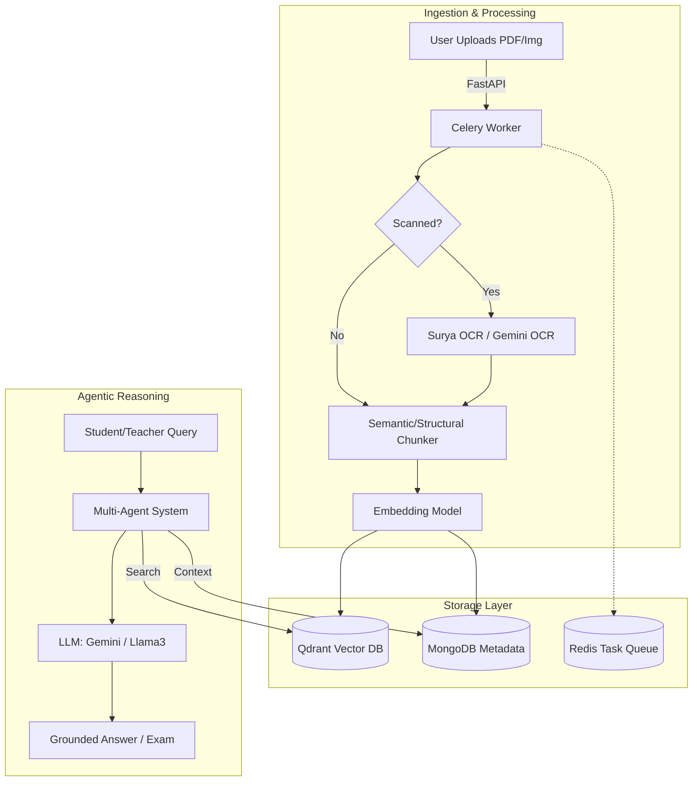

# Satr Edu AI - System Architecture & Technical Overview

## 1. System Overview
Satr Edu AI is an advanced enterprise-grade educational platform built on a Retrieval-Augmented Generation (RAG) and Agentic reasoning foundation. The system transforms unstructured educational content (PDFs, PPTXs, Images) into interactive AI tutors, automated exams, and adaptive learning environments.

## 2. Core Components

### 2.1. Ingestion & Processing Pipeline
- **Parsers**: Custom parsers for diverse formats (PDF, DOCX, PPTX).
- **GPU-Accelerated OCR**: Integrates `Surya OCR` and `DeepSeek/Gemini OCR` for extracting text from scanned documents and images with high fidelity.
- **Chunking Engine**: Uses structural and semantic chunking to ensure data is logically divided before embedding.

### 2.2. Storage Layer
- **Vector Database (Qdrant)**: Stores high-dimensional vector embeddings for fast semantic search and retrieval.
- **NoSQL Database (MongoDB)**: Stores relational data, project metadata, users, chat histories, exam results, and analytics.
- **Caching (Redis)**: Manages Celery task queues and caches frequent queries.

### 2.3. Agentic & LLM Engine
- **Multi-Agent System**: Utilizes a ReAct (Reasoning + Acting) architecture where agents can decide which tools to use.
- **Memory & Context**: Maintains long-term memory across sessions.
- **LLM Abstraction**: Supports seamless switching between Gemini (1.5 Flash), Ollama (Local Llama3), and Cohere.

### 2.4. Core Application Logic (FastAPI)
- Contains 83 optimized endpoints structured logically into modules: `ai`, `auth`, `admin`, `chat`, `exam`, `evaluation`, `pipeline`, etc.
- Async I/O for high concurrency.

## 3. Workflow Examples

### Document Processing Workflow:
1. User uploads a PDF (`/api/v1/documents/{project_id}/upload`).
2. Celery worker picks up the task.
3. If scanned, Surya OCR extracts text.
4. Semantic Chunker divides text into logical nodes.
5. Embedding model generates vectors.
6. Vectors are saved to Qdrant, metadata to MongoDB.

### Exam Generation Workflow:
1. Teacher requests an exam (`/api/v1/exam/create`).
2. Multi-retriever pulls relevant content from Qdrant.
3. RAG Agent synthesizes MCQs and Essay questions using Gemini.
4. Exam is saved as DRAFT in MongoDB.
5. Teacher approves it, making it visible to students.

## 4. Technology Stack
- **Backend**: Python 3.13, FastAPI, Celery
- **Databases**: MongoDB, Qdrant, Redis
- **AI/ML**: LangChain, LlamaIndex, Gemini APIs, Surya OCR
- **DevOps**: Docker, Docker Compose, Nginx

*(Refer to `Project_Documentation.md` for the complete API reference list of all 83 routes).*
